# 微信自动化端到端流程图

## 主流程

```mermaid
flowchart TD
    Start([开始]) --> Input[/输入: 联系人名 contact_name, 消息 message/]
    Input --> TplCheck{模板存在?<br/>templates/contact_name.jpg}
    TplCheck -->|否| FailTpl[❌ 模板不存在,退出]
    TplCheck -->|是| Stage1

    subgraph Stage1[阶段一: 搜索+点击头像+绿色环验证]
        direction TBB
        S1Start([阶段一开始]) --> S1Find[找微信主窗口<br/>find_largest_wechat_window]
        S1Find --> S1Cap[PrintWindow 截图主窗口]
        S1Cap --> S1Detect[检测分界线+搜索栏位置<br/>WeChatLayoutDetector]
        S1Detect --> S1Click[物理点击搜索栏<br/>SetCursorPos+mouse_event]
        S1Click --> S1Input[输入联系人名<br/>剪贴板+Ctrl+A+Ctrl+V]
        S1Input --> S1Wait1[等待 1s 搜索候选框出现]
        S1Wait1 --> S1FindCand[找搜索候选框窗口<br/>title=Weixin, class含ToolSaveBits]
        S1FindCand --> S1CapCand[PrintWindow 截图搜索候选框]
        S1CapCand --> S1Match[多尺度模板匹配<br/>scales=20-80px, 阈值0.6, NMS去重]
        S1Match --> S1MatchOK{匹配到头像?}
        S1MatchOK -->|否| S1RetryCheck
        S1MatchOK -->|是| S1ClickAvatar[点击头像<br/>距搜索框最近的匹配点]
        S1ClickAvatar --> S1Wait2[等待 1s 聊天界面出现]
        S1Wait2 --> S1CapMain[PrintWindow 截图主窗口]
        S1CapMain --> S1MatchMain[主窗口内多尺度匹配头像]
        S1MatchMain --> S1Green[绿色环检测<br/>BGR 112,172,21 容差30, 阈值0.4]
        S1Green --> S1GreenOK{绿色环验证通过?<br/>ratio>=0.4}
        S1GreenOK -->|否| S1RetryCheck
        S1GreenOK -->|是| S1Done([阶段一成功])
        S1RetryCheck{尝试次数 < 4?}
        S1RetryCheck -->|是| S1Prep[重试预备: 主窗口中间栏<br/>滚动滑轮3下+点击]
        S1Prep --> S1Find
        S1RetryCheck -->|否| S1Fail([阶段一失败])
    end

    S1Fail --> Fail([❌ 流程失败])
    S1Done --> Stage2

    subgraph Stage2[阶段二: 窗口数判定]
        direction TBB
        S2Start([阶段二开始]) --> S2Count[统计聊天窗口数<br/>排除搜索候选框 ToolSaveBits]
        S2Count --> S2Check{窗口数?}
        S2Check -->|1| S2Direct[1窗口: 联系人聊天界面<br/>直接进入阶段三]
        S2Check -->|2| S2History[2窗口: 历史聊天界面]
        S2History --> S2FindHist[找 搜索聊天记录 窗口]
        S2FindHist --> S2CapHist[PrintWindow 截图历史窗口]
        S2CapHist --> S2MatchHist[多尺度匹配头像<br/>选置信度最高]
        S2MatchHist --> S2DblClick[物理双击头像<br/>主窗口跳转到联系人聊天界面]
        S2DblClick --> S2Close[关闭 搜索聊天记录 窗口<br/>PostMessage WM_CLOSE]
        S2Close --> S2Verify[验证窗口数=1]
        S2Verify --> S2Done([阶段二成功])
        S2Direct --> S2Done
    end

    S2Done --> Stage3

    subgraph Stage3[阶段三: 输入+发送消息]
        direction TBB
        S3Start([阶段三开始]) --> S3Find[找最大微信窗口<br/>find_largest_wechat_window]
        S3Find --> S3Cap[PrintWindow 截图]
        S3Cap --> S3Detect[检测聊天区域分界线 session_right]
        S3Detect --> S3InputBox[计算输入框位置<br/>聊天区域底部中心, 距底部80px]
        S3InputBox --> S3ClickBox[物理点击输入框]
        S3ClickBox --> S3Input[输入消息<br/>剪贴板+Ctrl+A+Ctrl+V]
        S3Input --> S3ReCap[重新截图 发送按钮应变绿]
        S3ReCap --> S3FindBtn[从右下角1/3区域找绿色发送按钮<br/>BGR 117,195,0 容差30, 连通组件分析]
        S3FindBtn --> S3BtnOK{找到发送按钮?}
        S3BtnOK -->|否| S3Fail([阶段三失败])
        S3BtnOK -->|是| S3ClickBtn[物理点击发送按钮]
        S3ClickBtn --> S3Verify[截图验证]
        S3Verify --> S3Done([阶段三成功])
    end

    S3Done --> Success([✅ 端到端流程成功])
    S3Fail --> Fail
```



## 关键参数

| 参数 | 值 | 说明 |
|------|-----|------|
| 模板缩放尺度 | 20,30,40,45,50,60,70,80 px | 多尺度匹配，适配不同头像大小 |
| 匹配阈值 | 0.6 | TM_CCOEFF_NORMED 置信度阈值 |
| NMS 最小距离 | 20 px | 非极大值抑制去重 |
| 绿色环 BGR | (112, 172, 21) | RGB(21,172,112) 的 BGR 表示 |
| 绿色环容差 | 30 | 颜色容差 |
| 绿色环阈值 | 0.4 | 绿色像素占比阈值 |
| 发送按钮 BGR | (117, 195, 0) | RGB(0,195,117) 的 BGR 表示 |
| 发送按钮容差 | 30 | 颜色容差 |
| 输入框距底部 | 80 px | 输入框中心位置 |
| 最大尝试次数 | 4 | 初次 + 3 次重试 |
| 等待间隔 | 1 s | 搜索候选框/聊天界面出现等待 |

## 窗口类型

| 窗口 | title | class | 用途 |
|------|-------|-------|------|
| 主窗口 | 微信 | Qt51514QWindowIcon | 主界面，聊天界面 |
| 搜索候选框 | Weixin | Qt51514QWindowToolSaveBits | 搜索结果下拉框 |
| 历史聊天界面 | 搜索聊天记录 | Qt51514QWindowIcon | 点击搜索结果后的历史记录窗口 |

## 文件结构

```
<project_root>\send_message\
├── templates\
│   └── [REDACTED].jpg              # 联系人头像模板（按 <联系人名>.jpg 命名）
├── wechat_e2e_run.py         # 端到端主脚本（入口）
├── click_avatar_in_search_window.py  # 阶段一：搜索+点击+验证+重试
├── send_message_run.py       # 阶段三：输入+发送
├── test_stage_2_history.py   # 阶段二单独测试脚本
├── dynamic_detector.py       # 微信布局检测器（分界线）
├── test_current_wechat.py    # 窗口枚举+PrintWindow 截图
├── click_search_and_input.py # 物理点击+剪贴板输入工具
├── wechat_auto_flow.md       # 本流程图文档
└── outputs\                  # 截图+调试图输出目录
```

## 用法

```bash
# 端到端发送消息
python E:\Code\MaaFramework\examples\wechat_auto\wechat_e2e_run.py <联系人名> "<消息内容>"

# 示例
python E:\Code\MaaFramework\examples\wechat_auto\wechat_e2e_run.py [REDACTED] "你好"

# 单独测试阶段二（需先手动制造2窗口状态）
python <project_root>\send_message\test_stage_2_history.py [联系人名]
```
