# 自动回复微信消息框架 — 架构设计 v4

> 创建时间：2026-07-22
> 状态：**已实现**（Phase 1 MVP + Phase 2 完善 完成，Phase 3 部分完成）
> 实现完成日期：2026-07-23
> 关联：[Wiki 知识库](../docs/wiki/index.md)
> 整合来源：
>
> - 我的 v2：10 项改进点 + 三阶段路线图 + 降级方案 + Wiki 三层引用（date\_plan\_propose 工具已在 v4 终版删除）
> - 另一个 agent 的 v2：对话线索管理 + Wiki 贯穿全程 + 邀约深化 + 约会后闭环 + 用户案例库 + 定期汇报 + 约会前简报 + 多媒体评估
> - claude.md：landmine\_topics + 意图预分类 + 跨联系人查重 + 主动发起预算 + 模糊回应 + 手动覆盖学习 + 效果追踪
> - claude-pro.md：工具层硬约束 + 回复冷却 + Agent 承诺追踪 + 情绪轨迹 + 意图验证 + 静默断联 + 禁忌列表
> - advise.md：10 个改进点评审（P0-2 轮询间隔 / P1-4 双层画像 / P1-5 深夜降频 已在 v4 补充 2 中整合）
> - codex.md：6 个收口建议（版本状态/工具契约/实现分级/幂等规则/风格衰减/上线标准 已在 v4 补充 3 中整合）

## 文档状态分层（v4 补充 3 — codex.md 建议 1）

> **更新（2026-07-23）**：本文档原为目标架构方案，现已基本实现。第一层和第二层大部分已完成，第三层部分待办。

### 第一层：当前已实现（Existing）

| 组件 | 状态 | 说明 |
|------|------|------|
| `wechat_send` / `wechat_send_emoji` / `wechat_ocr` | ✅ 已实现 | 文本+表情包发送，含互斥锁 |
| `live_monitor_start` / `live_chat_read` 等 | ✅ 已实现 | 实时监听缓存 |
| `person_sync` / `person_brief` / `person_chat` 等 | ✅ 已实现 | 数据采集层 |
| `wiki_context` / `wiki_search` / `wiki_read` | ✅ 已实现 | Wiki 知识层 |
| `save_from_markdown` / `person_save_analysis` | ✅ 已实现 | 归档层 |
| `events_scan` / `events_save` | ✅ 已实现 | 事件检测 |
| `mcp_index.yaml` 中 analysis/emergency_reply/weekly/maintain workflow | ✅ 已实现 | 4 个现有 workflow |

### 第二层：目标架构（v4 设计，待实现）

| 组件 | 优先级 | 说明 |
|------|--------|------|
| `conversation_thread` | P0 | 对话线索管理 |
| `schedule_manage` | P0 | 用户日程 CRUD |
| `user_profile_manage` | P0 | 用户档案管理 |
| `date_briefing` | P0 | 约会前简报 |
| `recent_replies_check` | P0 | 跨联系人查重 |
| `wechat_send` 硬约束增强 | P0 | 线索已读校验 + 回复冷却 + urgent 参数 |
| `auto_reply` / `auto_reply_invite` / `auto_reply_notify` workflow | P0 | 3 个新 workflow |
| `date_feedback_loop` | P1 | 约会后反馈闭环 |
| `effect_tracking` | P1 | 效果追踪 |
| `override_learning` | P1 | 手动覆盖学习 |
| `server_chan_notify` | P1 | Server酱推送 |
| `contact_priority_manage` | P1 | 优先级管理 |
| `scripts/user_style_profile.py` | ✅ 已实现 | 前置批处理脚本，已生成 data/user_style_profile.yaml |

### 第三层：未实现待办（Future）

| 组件 | 优先级 | 说明 |
|------|--------|------|
| 多媒体发送（图片/视频） | P2 | 复用剪贴板机制，待评估 |
| 系统日历集成 | P2 | schedule_manage 方案 C |
| 跨进程互斥锁 | ✅ 已实现 | Win32 Named Mutex（cross_process_lock.py） |
| 委员会审查 subagent 隔离 | P2 | 通过 Task 工具开 subagent，prompt 差异化实现 |
| person_behaviors 与 auto_reply 联动 | P2 | 语义分析辅助信号，待评估 |

## 修订记录

| 版本           | 日期         | 修订内容                                                                                                                                                                                                    |
| ------------ | ---------- | ------------------------------------------------------------------------------------------------------------------------------------------------------------------------------------------------------- |
| v1           | 2026-07-21 | 初版：定位与边界、整体架构、流程时序、多联系人并发、轮询间隔、委员会审查、缺口分析、新增 MCP 工具规格、融合点、关键决策、实施路线图                                                                                                                                    |
| v2（我的）       | 2026-07-22 | ① Wiki 知识引用策略（三层）；② date\_plan\_propose MCP 工具；③ 10 项改进点（P0×2/P1×4/P2×4）；④ 三阶段实施路线图                                                                                                                     |
| v2（另一 agent） | 2026-07-22 | ① 对话线索管理组件；② Wiki 贯穿全程；③ 邀约决策深化；④ 约会后反馈闭环；⑤ 用户案例库；⑥ 定期汇报；⑦ 约会前简报；⑧ 多媒体评估                                                                                                                                |
| v3           | 2026-07-22 | 整合四份文档：以 v2（我的）为骨架，吸收 v2（另一 agent）的 8 大组件，补入 Claude 7 点 + Claude Pro 7 点战术改进                                                                                                                            |
| v3 修订        | 2026-07-22 | Agent 定位原则修订：删除意图预分类流程图、自然语言解析层；将邀约窗口检测/静默断联/邀约三阶递进的决策流程图改为工具规格 + Agent 自主决策                                                                                                                            |
| v4 终版        | 2026-07-22 | 应用 Agent 化身原则：删除 reply\_timing\_analyze/user\_style\_extract/date\_plan\_propose 三个工具；删除 conversation\_thread.my\_promises 字段；user\_style 改为前置批处理；schedule\_manage 确定为纯 CRUD；新增 server\_chan\_notify 工具 |
| v4 补充        | 2026-07-22 | 补充 7 个遗漏点：①emergency\_reply 与 auto\_reply 关系（1.3 节）；②失败退避策略（7.7 节）；③contact\_priority\_manage 工具（10.6 节）；④归档内容标准化格式（6.13 节）；⑤日程数据来源决策（10.7 节）；⑥mcp\_index.yaml 注册格式（第二十章）；⑦"她一直聊但不见面"场景引用（10.1 节）       |
| v4 补充 2       | 2026-07-22 | 对照 advise.md 10 个改进点，补充 3 个未完全覆盖点：①P0-2 轮询间隔改为 10 秒轻量轮询 + 消息完整性检测 + 区分 her\_send\_gap/user\_reply\_gap（5.1/5.2 节）；②P1-4 用户风格画像改为双层结构（统一基准 + 联系人特化，7.2 节）；③P1-5 深夜规则统一为分时段降频 + 紧急豁免 + 联系人作息调整（5.6 节） |
| v4 补充 3       | 2026-07-22 | 对照 codex.md 6 个收口建议全部补充：①建议 1 文件重命名 v3→v4 + 文档状态三层分层（已实现/目标架构/未实现待办）；②建议 2 新增 10 个工具的"输入/输出/不做什么"契约表（第十八章）；③建议 3 实现分级表（第十七章 17.4 节）；④建议 4 幂等/取消/失败重试状态机（7.8 节）；⑤建议 5 风格画像衰减+置信度（7.2 节）；⑥建议 6 上线标准与观测指标（第二十二章） |
| v4 补充 4       | 2026-07-22 | 对照 codex.md 更新（架构修正）：①用户画像拆分三类文件（user\_profile\_fact / user\_style\_profile / user\_bad\_patterns，7.2 节）；②策略优先级重定义（Wiki > 上下文 > 事实 > 阶段 > 风格，7.2.2 节）；③"用户风格审查官"→"用户一致性审查官"+ 5 项检查职责（7.3 节）；④user\_profile\_manage 工具规格更新支持三类文件（11.4 节）；⑤工具契约表 23.5 更新；⑥决策 #12 修订 + 新增 #62-63 |
| v4 补充 5       | 2026-07-22 | 实现质量审查修复 + 文档同步：①三重硬约束→四重硬约束（新增硬约束 0 user\_took\_over 校验，6.4/17.3 节）；②新增 reply\_state\_manage 工具实现 Agent 行为层状态机（7.7 + 7.8.4 节）；③7.8.2 节增加硬约束 0 实现说明；④7.8.4 节增加 reply\_state\_manage 实现说明；⑤第二十三章新增 23.12 reply\_state\_manage 契约；⑥23.11 通用约束工具数 10→11；⑦17.4 实现分级表更新已实现状态；⑧决策表新增 #64-65 |

***

## 〇、Agent 定位原则（全局约束）

> **此原则优先于本文档所有其他设计。如其他章节与此原则冲突，以此原则为准。**

1. **Agent = LLM = 用户化身**：Agent 本身是 LLM，具备自然语言理解能力，是用户的化身
2. **不绕过 Agent 搭建语义理解层**：不设计"自然语言解析流程图""意图分类器"等额外解析层
3. **我们只提供工具**：架构设计描述工具能力（输入/输出/副作用），不描述 Agent 如何理解用户意图
4. **Agent 自己决定做什么**：不为 Agent 预先设计决策流程，Agent 基于工具返回的数据自主决策
5. **用户与 Agent 沟通**：用户有事直接和 Agent 说，Agent 自己理解并调用工具写入系统记录

**反模式**（已修订删除）：

- ❌ 设计"自然语言日程解析流程图"（可用时间声明/具体约会安排/偏好声明/临时变化分类）
- ❌ 设计"消息意图预分类流程图"（question/sharing/emotion/landmine\_hit/casual 分类）
- ❌ 设计"邀约窗口检测决策流程图"（阶段→停留时间→IOI→邀约历史→被拒次数的分支判断）

**正确模式**：

- ✅ 提供 `schedule_manage(action="update")` 工具，Agent 自己理解用户说的话决定调什么 action
- ✅ 提供 `conversation_thread(action="update")` 工具，Agent 自己判断消息意图并更新对应字段
- ✅ 提供 `date_window_detect(name)` 工具返回客观数据（窗口强度/IOI/邀约历史），Agent 自己决定是否邀约

***

## 一、定位与边界

### 1.1 我们做什么 / 不做什么

| 维度     | 我们做                                                           | 我们不做                                     |
| ------ | ------------------------------------------------------------- | ---------------------------------------- |
| Agent  | ❌ 不做新 Agent 框架                                                | ✅ 复用外部 Agent（CC / Cursor / Trae Agent 等） |
| Skill  | ✅ 写流程说明文档（指挥 Agent 怎么走）                                       | —                                        |
| MCP    | ✅ 补充必要的 MCP 工具（提供能力）                                          | ❌ 不重写已有 MCP 工具                           |
| 委员会    | ✅ 在 Skill 中描述 5 个审查角度，由 Agent 自己扮演                            | ❌ 不写独立的 Subagent 进程                      |
| 归档     | ✅ 在 Skill 中指导 Agent 用 `save_from_markdown` + `person_note` 归档 | ❌ 不做独立的 `auto_reply_log` MCP 工具          |
| 工具层硬约束 | ✅ 在 MCP 工具层强制校验（如发送前必读线索）                                     | ❌ 不依赖 Skill 文档的软约束                       |

### 1.2 核心理念

**「Skill 即流程，MCP 即能力，Agent 即执行者，工具层硬约束保底」**

- **Skill 文档** = 剧本（告诉 Agent 怎么演完整场戏）
- **MCP 工具** = 道具（Agent 演戏需要的所有工具）
- **Agent** = 演员（外部已有的 LLM Agent，按剧本调用道具）
- **工具层硬约束** = 安全网（即使 Agent 偷懒跳过步骤，工具层也会强制校验）

### 1.3 与现有 emergency\_reply 的关系

**两者并存，由 Agent 根据场景自主选择**。

| 维度    | emergency\_reply（现有）                      | auto\_reply（新增）     |
| ----- | ----------------------------------------- | ------------------- |
| 触发方式  | 用户主动问"她发了XX怎么回"                           | 轮询监听自动触发            |
| 输出方式  | 给用户回复建议（用户自己发）                            | 自动发送（无需用户介入）        |
| 委员会审查 | 无                                         | 5 角度审查              |
| 时机控制  | 立即回复                                      | Agent 分析最佳时机 + 回复冷却 |
| 用户风格  | 不考虑                                       | 强制审查是否符合用户风格        |
| 风险审查  | 不审查                                       | 强制风险审查              |
| 对话线索  | 不维护                                       | 回复前必读 + 回复后更新       |
| 适用场景  | 用户在场、需要讨论、敏感话题（讨论性话题如果是wiki中认为需要的，不用询问用户） | 用户不在场、日常聊天、低风险回复    |

**切换逻辑（Agent 自主决策）**：

- Agent 正在自动回复某联系人 → 用户主动询问该联系人的回复建议 → Agent 切换到 emergency\_reply 模式，与用户讨论
- emergency\_reply 模式下用户确认发送 → 走 auto\_reply 的硬约束校验（线索已读 + 回复冷却 + 互斥锁）后发送
- 两者共享同一份对话线索文件（conversation\_thread），确保上下文一致

**Skill 文档关系**：

- `skill/workflows/emergency_reply.md`（现有）：用户主动触发的回复建议流程
- `skill/workflows/auto_reply.md`（新增）：自动回复完整流程
- Agent 读取两个 Skill 文档，自主判断当前场景应走哪个流程

***

## 二、整体架构图（v3 整合版）

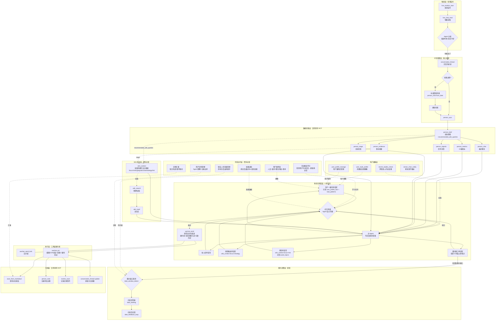

***

## 三、流程时序图（v3 完整版）

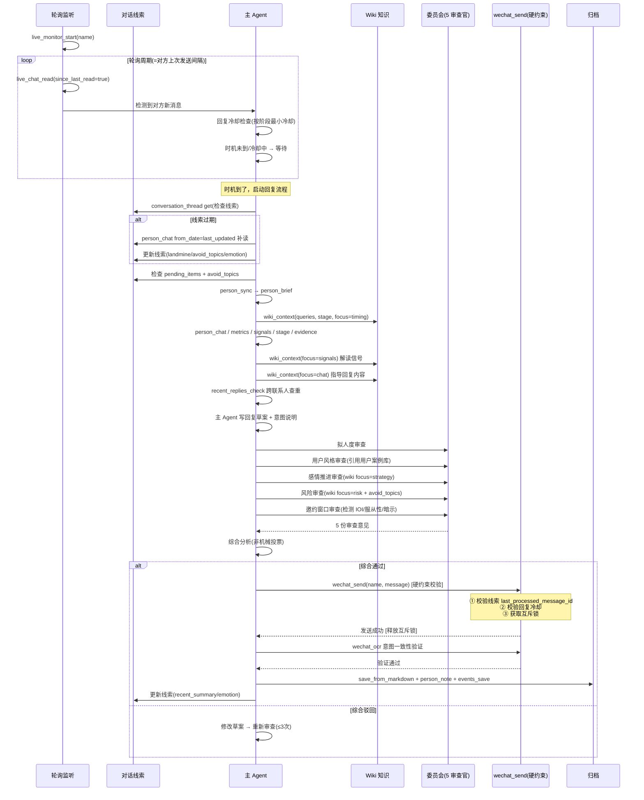

***

## 四、多联系人并发架构

```mermaid
flowchart TB
    subgraph 多Agent并发[多主 Agent 并发 - 每联系人一个]
        MA1[主 Agent A<br/>监听联系人 A]
        MA2[主 Agent B<br/>监听联系人 B]
        MA3[主 Agent C<br/>监听联系人 C]
    end

    subgraph 数据层[数据层 - 可并发]
        DL1[person_sync A]
        DL2[person_sync B]
        DL3[person_sync C]
    end

    subgraph 线索层[对话线索层 - 每人独立]
        TL1[conversation_thread A<br/>data/conversation_threads/wxid_A.yaml]
        TL2[conversation_thread B<br/>data/conversation_threads/wxid_B.yaml]
        TL3[conversation_thread C<br/>data/conversation_threads/wxid_C.yaml]
    end

    subgraph 跨联系人[跨联系人共享层]
        CL1[recent_replies.yaml<br/>跨联系人内容查重]
        CL2[user_profile.yaml<br/>用户案例库(共享)]
        CL3[avoid_topics_global<br/>全局禁忌]
    end

    subgraph 微信操作层[微信操作层 - 互斥!]
        Lock{{wechat_send_mutex<br/>互斥锁}}
        WS[wechat_send<br/>视觉自动化+硬约束]
    end

    MA1 --> DL1 --> TL1
    MA2 --> DL2 --> TL2
    MA3 --> DL3 --> TL3

    TL1 & TL2 & TL3 -.-> CL1 & CL2 & CL3

    MA1 -. 等待锁 .-> Lock
    MA2 -. 等待锁 .-> Lock
    MA3 -. 等待锁 .-> Lock

    Lock --> WS

    Note1[笔记: 数据层+线索层并发无冲突<br/>跨联系人共享层只读<br/>微信操作必须串行]
```

### 4.1 并发规则

| 层级                                         | 并发性        | 原因                    |
| ------------------------------------------ | ---------- | --------------------- |
| 监听层（`live_monitor`）                        | ✅ 完全并发     | 每个联系人独立监听进程           |
| 数据采集层（`person_sync` / `person_brief` 等）    | ✅ 完全并发     | 数据库读写不冲突              |
| 对话线索层（`conversation_thread`）               | ✅ 完全并发     | 每人独立 YAML 文件          |
| 跨联系人共享层（`recent_replies` / `user_profile`） | ⚠️ 读并发/写串行 | 多 Agent 同时读无冲突，写需要文件锁 |
| Wiki 知识层（`wiki_context` 等）                 | ✅ 完全并发     | 只读操作                  |
| 委员会审查层                                     | ✅ 完全并发     | Agent 内部推理            |
| 微信操作层（`wechat_send` / `wechat_ocr`）        | ❌ **必须互斥** | 视觉自动化会抢鼠标键盘，并发会冲突     |

### 4.2 互斥锁实现要点

- 已有 `_wechat_op_lock = threading.Lock()`（在 [mcp\_server/tools\_wechat.py](../mcp_server/tools_wechat.py#L210)）
- 当前实现已保护 `wechat_send` 和 `wechat_ocr` 互斥
- **跨进程场景**：`threading.Lock` 仅在同进程有效，跨进程需要用 `portalocker`（文件锁）或系统级互斥
- **v3 改进**：推荐单进程多线程架构（一个 Agent 进程内多线程监听多联系人），避免跨进程锁复杂性

***

## 五、轮询间隔策略 + 回复冷却机制

### 5.1 核心规则（v4 修订 — 区分两种间隔 + 消息完整性检测）

**关键区分**：必须区分两种间隔概念，避免"对方快速连发就被打断"或"对方长时间不回就冷场"。

| 间隔类型                         | 定义           | 用途                |
| ---------------------------- | ------------ | ----------------- |
| **对方发送间隔**（her\_send\_gap）   | 对方两次发送消息的时间差 | 评估对方聊天节奏（快/慢/中断）  |
| **用户应回间隔**（user\_reply\_gap） | 用户应当回复的时间窗口  | 判断 Agent 何时触发回复流程 |

**核心规则**：

- **轮询节奏**：固定 10 秒轻量轮询（仅查询是否有新消息，不触发回复）
- **回复触发**：基于"消息完整性检测"而非"对方间隔"
- **深夜处理**：降频而非完全不轮询（见 5.2）

**消息完整性检测**（v4 新增）：

对方发完一条消息后，可能还会继续发下一条（连发习惯）。直接基于"对方间隔"触发回复会导致：

- 打断对方未说完的话
- 暴露自动回复特征（回复速度异常）

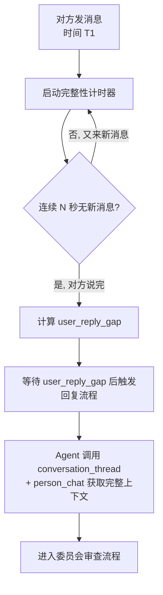

**完整性阈值 N 的设定**（按关系阶段动态调整）：

| 关系阶段              | 完整性阈值 N | 理由               |
| ----------------- | ------- | ---------------- |
| Stage 1-2 初识/基本互动 | 90 秒    | 不熟络，连发少，等久一点确认说完 |
| Stage 3 高频聊天      | 30 秒    | 高频聊天连发多，30 秒足够确认 |
| Stage 4+ 已约见/持续接触 | 45 秒    | 稳定关系，中等阈值        |

**user\_reply\_gap 的计算**（区分于 her\_send\_gap）：

```python
# user_reply_gap 不等于 her_send_gap
# 它由三个因素综合决定：
user_reply_gap = base_stage_gap          # 阶段基准（Stage 1-2: 10min, Stage 3: 3min, Stage 4+: 1min）
              + activity_adjustment       # 当前活跃度调整（双方都在快速聊天 → 缩短）
              - emotion_boost             # 情绪高涨时缩短（her_emotion.score > 0.7）
              - urgency_boost             # 紧急情况缩短（urgent=True 时绕过）
```

### 5.2 间隔计算的边界处理（v4 修订 — 修复深夜规则矛盾）

| 场景                       | 处理                                       |
| ------------------------ | ---------------------------------------- |
| 对方只发过 1 条消息（无历史间隔）       | 默认 5 分钟轮询，完整性阈值取阶段默认值                    |
| 对方发送间隔极短（< 30 秒，可能在快速聊天） | **不立即触发回复**，启动完整性检测，等 N 秒无新消息后再判断        |
| 对方发送间隔极长（> 1 小时，可能不在聊天）  | 上限 10 分钟轮询，但仍保持轻量轮询不停止                   |
| **深夜时段（23:00-08:00）**    | **降频轮询（30 秒/次）+ 紧急豁免 + 联系人作息调整**（详见 5.6） |
| 对方静默 > 48 小时             | 触发静默断联诊断（见 5.5）                          |
| 检测到完整性达到阈值但情绪激动          | 缩短 user\_reply\_gap（避免冷场）                |
| 检测到完整性达到阈值但话题敏感          | 延长 user\_reply\_gap（避免冲动回复）              |

### 5.3 回复冷却机制（v3 新增 — Claude Pro #2）

**问题**：如果对方秒回，Agent 也秒回，会暴露是自动回复。

**设计**：在 `wechat_send` 层面维护 `last_send_time`，按阶段设置最小冷却：

| 关系阶段              | 最小冷却  | 理由            |
| ----------------- | ----- | ------------- |
| Stage 1-2 初识/基本互动 | 30 分钟 | 低频聊天，秒回显得需求感强 |
| Stage 3 高频聊天      | 5 分钟  | 高频但不秒回        |
| Stage 4+ 已约见/持续接触 | 3 分钟  | 稳定关系可稍快       |

**实现**：

```python
def wechat_send(name, message, urgent=False):
    if not urgent:
        stage = get_person_stage(name)
        cooldown = {1: 1800, 2: 1800, 3: 300, 4: 180, 5: 180}.get(stage, 300)
        last_send = get_last_send_time(name)
        elapsed = (datetime.now() - last_send).total_seconds()
        if elapsed < cooldown:
            raise CooldownError(
                f"回复冷却中，还需等待 {cooldown - elapsed:.0f} 秒",
                suggested_wait=cooldown - elapsed
            )
    # ... 正常发送流程
```

**紧急绕过**：`urgent=true` 参数（如对方连续追问"在吗"）

### 5.4 时机判断（Agent 自主决策）

**原则**：Agent 是用户的化身，具备自然语言理解能力，自己判断回复时机。不设计专门的时机分析工具。

**Agent 判断时机的依据**：

- `person_metrics` 返回的回复延迟分布、主动率等量化数据
- `conversation_thread` 中的 `her_emotion.trajectory`（情绪趋势）和 `initiative_tracker`（主动发起预算）
- `wiki_context(focus=timing)` 注入的频率操作手册、阶段性聊天、需求感控制等知识
- 当前时间上下文（深夜/工作时段/周末）

**Wiki 依据**：[频率操作手册](../docs/wiki/wiki/entities/频率操作手册.md) + [需求感控制](../docs/wiki/wiki/entities/需求感控制.md) + [阶段性聊天](../docs/wiki/wiki/entities/阶段性聊天.md)

**硬约束保留**：`wechat_send` 层面的回复冷却机制（5.3 节）仍然强制执行，防止秒回暴露自动回复。

### 5.5 静默/断联的主动策略（v3 新增 — Claude Pro #6）

**问题**：对方 48 小时没回复，不是"不需要回复"，而是需要主动断联诊断。

**设计**：当对方 48h+ 未回复时，系统检测到静默状态并通知 Agent。Agent 自主诊断原因并决定策略。

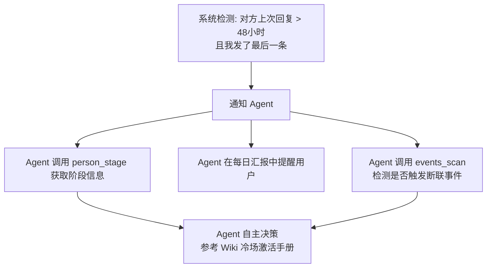

**Agent 自主决策参考**（非硬性规则）：

- 阶段 >= 3：建议用户手动跟进一条（不自动发）
- 阶段 < 3：继续等待，按频率法则处理
- 特殊情况（对方出差/生病/忙）由 Agent 结合对话线索判断

**Wiki 依据**：[冷场激活手册](../docs/wiki/wiki/entities/冷场激活手册.md) + [删除你的女人重新激活](../docs/wiki/wiki/entities/删除你的女人重新激活.md)

### 5.6 深夜降频策略（v4 新增 — 统一文档矛盾）

**问题**：原 v1 规则"23:00-08:00 完全不轮询"过于绝对，存在两类风险：

- 对方深夜主动发消息不回 → 显得冷漠
- 紧急情况（如对方情绪崩溃求助）不能漏

**v4 统一规则**（取代原 5.2 节"深夜不轮询"和 P1-3 的"不轮询 + 紧急豁免"表述）：

| 时段                | 轮询频率         | 回复行为                               | 通知                                             |
| ----------------- | ------------ | ---------------------------------- | ---------------------------------------------- |
| 23:00-02:00（深夜前期） | 30 秒/次（降频）   | 仅 urgent=True 触发自动回复；其他延迟到次日 08:00 | 普通消息不通知，紧急消息 server\_chan\_notify 推送           |
| 02:00-06:00（深夜中期） | 2 分钟/次（深度降频） | 完全不自动回复，但检测紧急关键词                   | 检测到"睡不着"/"难过"/"想聊天"等立即 server\_chan\_notify 推送 |
| 06:00-08:00（清晨）   | 30 秒/次（恢复）   | 累积的消息批量处理，按 user\_reply\_gap 顺序回复  | 无                                              |
| 08:00-23:00（正常时段） | 10 秒/次（标准）   | 按 5.1 节标准流程                        | 无                                              |

**紧急豁免规则**：

- `urgent=True` 参数不受时段限制
- 紧急关键词检测命中（"救命"/"想死"/"崩溃"/"分手"等）→ 立即 server\_chan\_notify 通知用户，不自动回复
- 对方连续 3 条消息未回（可能紧急）→ server\_chan\_notify 通知用户

**联系人作息调整**：

- 通过 `user_profile_manage` 记录每个联系人的作息（早睡型/夜猫型/正常型）
- 夜猫型联系人 23:00-01:00 仍按正常时段处理
- 早睡型联系人 22:00 后即进入降频模式
- 默认按通用时段处理，作息数据缺失时不假设

**Wiki 依据**：[频率操作手册](../docs/wiki/wiki/entities/频率操作手册.md) + [需求感控制](../docs/wiki/wiki/entities/需求感控制.md)

***

## 六、对话线索管理组件（v3 核心组件）

### 6.1 问题背景

**现有工具的局限**：

- `person_chat`：获取原始聊天记录，但**不强制 Agent 阅读全部**。Agent 可能只读 recent=30 条就开始回复，遗漏早期上下文
- `person_evidence`（事实库）：记录长期重要事实，**不是为聊天连贯性设计的**
- `person_metrics`：量化指标，**不含质性内容**

**风险**：Agent 只读一部分对话就开始聊天，会导致重复问、错过话题、上下文断裂、忽略待回复事项。

### 6.2 对话线索 vs 现有数据层

| 数据层                        | 时间跨度     | 内容             | 用途          |
| -------------------------- | -------- | -------------- | ----------- |
| **原始消息**（person\_chat）     | 全量历史     | 每条消息原文         | 需要时查阅       |
| **对话线索**（新）                | 最近 1-3 天 | 话题摘要+待回复+情绪+禁忌 | **自动回复前必读** |
| **事实档案**（person\_evidence） | 长期       | 重要事实           | 分析时参考       |
| **指标**（person\_metrics）    | 全量统计     | 量化数据           | 阶段判断        |

### 6.3 线索文件数据结构（v3 整合版）

```yaml
# 文件路径: data/conversation_threads/<wxid>.yaml
# 每个联系人独立一个线索文件

last_updated: 2026-07-22T14:30:00
last_message_id: 12345
last_message_time: 2026-07-22T14:25:00
last_processed_message_id: 12345  # v3 新增：工具层硬约束校验依据

# 最近对话摘要（Agent 提炼，不是原文复制）
# 最多保留 20 条，超出则最旧的归档到事实库
recent_summary:
  - time: "2026-07-22 14:00"
    who: "her"
    summary: "分享了今天去咖啡店的经历，提到喜欢手冲"
  - time: "2026-07-22 14:15"
    who: "me"
    summary: "推荐了一家手冲店，她说有兴趣试试"
  - time: "2026-07-22 14:25"
    who: "her"
    summary: "问周末有没有空，想一起去"

# 当前活跃话题线索（最多 5 个）
current_threads:
  - topic: "手冲咖啡"
    status: "active"
    last_mentioned: "2026-07-22 14:25"
    context: "她喜欢手冲，我推荐了 XX 店"
  - topic: "周末约会"
    status: "pending_response"
    last_mentioned: "2026-07-22 14:25"
    context: "她主动问周末有没有空"

# 未完成的对话项（对方说了需要回复的）
pending_items:
  - type: "question_from_her"
    content: "周末有没有空"
    time: "2026-07-22 14:25"
    urgency: "high"

# v3 新增：情绪轨迹（不只点状态，Claude Pro #4）
her_emotion:
  trajectory:  # 最近 5 次
    - { time: "07-20 16:00", state: "消极", signals: ["回复慢", "简短"] }
    - { time: "07-21 10:00", state: "中性", signals: ["恢复正常速度"] }
    - { time: "07-21 22:00", state: "积极", signals: ["主动分享", "发表情"] }
    - { time: "07-22 14:00", state: "积极", signals: ["分享日常"] }
    - { time: "07-22 14:25", state: "积极", signals: ["主动邀约"] }
  trend: "回升"  # 回升/平稳/下降/波动
  current_state: "积极"

# v3 新增：已消耗话题清单（Claude #1）
# Agent 不会问已经知道答案的问题
landmine_topics:
  - topic: "去上海干嘛"
    reason: "已知是出差，再问显得没记住"
    added_by: "user_feedback"  # user_feedback / auto_detect
    added_at: "2026-07-22"
  - topic: "拼豆进展"
    reason: "一次性活动，已完成"
    added_by: "auto_detect"
    added_at: "2026-07-20"

# v3 新增：短期禁忌列表（Claude Pro #7）
# 当前对话阶段不应该聊的方向
avoid_topics:
  - "不要问她去上海干嘛（出差，不方便聊）"
  - "拼豆是一次性活动，已完成，不要问进展"
  - "下次约会要等出国回来，不要聊近期的"

# 关键上下文（本轮对话中提到的重要信息，非长期事实）
# 最多 10 条，超出则最旧的写入事实库后移除
key_context:
  - "她今天去了 XX 咖啡店"
  - "她周末有空"
  - "她对手冲咖啡感兴趣"

# v3 新增：主动发起追踪（Claude #4）
initiative_tracker:
  last_5_initiatives: ["me", "her", "me", "her", "me"]
  my_initiative_ratio: 0.6
  target: 0.4-0.5  # 理想比例（对方应该多主动一点）
  status: "overly_initiative"  # overly_initiative / balanced / being_pursued
```

### 6.4 工具层硬约束（v3 关键改进 — Claude Pro #1，v4 补充 5 修订为四重）

**问题**：conversation\_thread 依赖 Agent 自觉去读，和 person\_chat recent=30 的问题本质一样——工具提供了，Agent 可能偷懒跳过。

**解决方案**：把"回复前必读线索"从 Skill 文档的软约束变成工具层的硬约束。

**实现**：在 `wechat_send` 调用时自动校验：

```python
def wechat_send(name, message, urgent=False):
    # 硬约束 0：校验用户介入取消（v4 补充 5 新增，7.8.2 节，最高优先级）
    thread = get_thread(name)
    if thread.user_took_over:
        raise UserTookOverError(
            f"用户已手动接管（{thread.user_took_over_time}），自动回复已暂停。"
            f"用户可通过 talk.md 写入 '恢复 {name} 的自动回复' 清除接管状态"
        )

    # 硬约束 1：校验线索已读
    latest_msg = get_latest_message_id(name)
    if thread.last_processed_message_id < latest_msg:
        raise NeedCatchUpError(
            f"尚未处理 {latest_msg - thread.last_processed_message_id} 条新消息，"
            f"请先调用 conversation_thread('{name}', action='catch_up')"
        )

    # 硬约束 2：校验回复冷却（见 5.3）
    if not urgent:
        check_cooldown(name)

    # 硬约束 3：获取互斥锁
    with _wechat_op_lock:
        # ... 正常发送流程
        pass
```

**四重硬约束**（v4 补充 5 修订，原三重 + 用户介入取消）：

0. **用户介入取消校验**（v4 补充 5 新增，最高优先级）：`conversation_thread.user_took_over == False`
1. **线索已读校验**：`last_processed_message_id >= latest_message_id`
2. **回复冷却校验**：按阶段最小冷却
3. **互斥锁校验**：视觉自动化串行

> **优先级顺序**：硬约束 0 > 硬约束 1 > 硬约束 2 > 硬约束 3。任一约束失败立即返回错误，不继续后续校验。

### 6.5 读取流程（自动回复主流程的第一步）

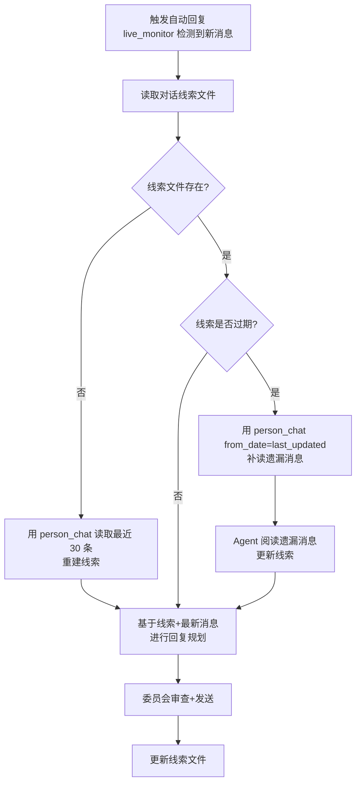

### 6.6 过期阈值（按关系阶段）

| 关系阶段          | 过期阈值  | 理由            | Wiki 依据                                               |
| ------------- | ----- | ------------- | ----------------------------------------------------- |
| Stage 1 初识    | 12 小时 | 低频聊天，每天 1-2 轮 | [频率操作手册](../docs/wiki/wiki/entities/频率操作手册.md) 阶段 1   |
| Stage 2 基本互动  | 12 小时 | 每天 1-3 轮，间隔较长 | [频率操作手册](../docs/wiki/wiki/entities/频率操作手册.md) 阶段 2   |
| Stage 3 高频聊天  | 6 小时  | 每天 2-5 轮，间隔短  | [频率操作手册](../docs/wiki/wiki/entities/频率操作手册.md) 阶段 3   |
| Stage 4 已约见   | 3 小时  | 见面后保持频率       | [第一次约会回来之后](../docs/wiki/wiki/scenarios/第一次约会回来之后.md) |
| Stage 5+ 持续接触 | 3 小时  | 稳定联系          | [频率操作手册](../docs/wiki/wiki/entities/频率操作手册.md) 阶段 4   |

### 6.7 更新流程（回复发送后）

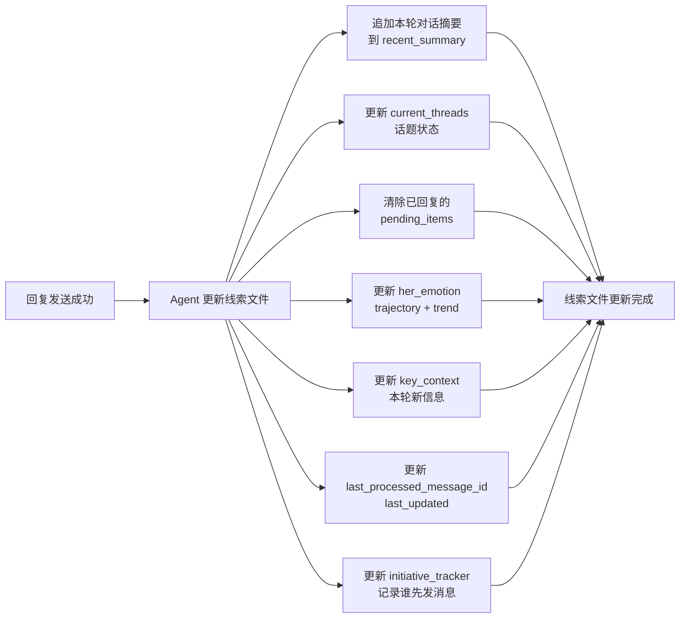

> **注**：Agent 承诺的事由 recent\_summary 记录，Agent 自己记得说过什么，不需要专门字段追踪。

### 6.8 消息意图理解（Agent 天然能力 — 不做额外设计）

> **设计原则**：意图理解是 LLM 的天然能力，不搭建额外的意图预分类层。
>
> Agent 读取消息后，自主判断对方意图（提问/分享/表达情绪/闲聊/邀约等），并自主决定更新线索文件的哪些字段（pending\_items / key\_context / her\_emotion 等）。
>
> 我们只提供 `conversation_thread(action="update")` 工具，Agent 自己决定调用什么 action、更新什么字段。不设计预分类流程图。

### 6.9 对话线索 MCP 工具

**工具名**：`conversation_thread`

**参数**：

```python
{
  "action": "get|update|append_summary|clear|check_expired|catch_up|add_landmine|add_avoid_topic",
  "name": "[REDACTED]",
  "summary": {...},             # append_summary 时使用
  "update_fields": {...},       # update 时使用
  "current_stage": 3,           # check_expired 时使用
  "landmine": {...},            # add_landmine 时使用
  "avoid_topic": "...",         # add_avoid_topic 时使用
}
```

**返回**：

- `get`：完整线索文件内容
- `check_expired`：`{"expired": bool, "elapsed_hours": float, "threshold_hours": int, "last_updated": str}`
- `catch_up`：`{"caught_up_messages": int, "new_pending_items": int, "updated": true}`
- 其他 action：操作结果

### 6.10 线索与现有工具的协作

| 工具                   | 协作关系                                      |
| -------------------- | ----------------------------------------- |
| `person_chat`        | 线索过期时，用 `from_date=last_updated` 补读遗漏消息   |
| `person_brief`       | 线索是 brief 的**短期补充**（brief 是概览，线索是当前上下文）   |
| `live_monitor`       | 检测到新消息触发回复 → **回复前先检查线索**                 |
| `save_from_markdown` | 线索 recent\_summary 超过 20 条时，最旧的**归档到事实库** |
| `person_evidence`    | 线索的 key\_context 中发现的**长期事实**写入事实库        |
| `person_stage`       | 提供当前阶段，用于判断线索过期阈值 + 回复冷却                  |
| `wechat_send`        | **硬约束校验**：发送前检查线索已读 + 回复冷却                |
| `wechat_ocr`         | 发送后意图验证 + 触发线索更新                          |
| `wiki_context`       | avoid\_topics 作为参数传入，让 Wiki 框架知道不应引导的方向   |

### 6.11 线索大小控制

- `recent_summary`：最多 20 条，超出则最旧的归档到事实库
- `current_threads`：最多 5 个活跃话题，关闭的话题移除
- `key_context`：最多 10 条，超出则最旧的写入事实库后移除
- `her_emotion.trajectory`：最多 5 条，超出则最旧的移除
- `landmine_topics`：无上限，持续积累
- `avoid_topics`：无上限，但定期清理过期的

### 6.12 线索丢失恢复

如果线索文件丢失/损坏：

1. Agent 用 `person_chat(recent=30)` 读取最近消息
2. 生成初始线索（recent\_summary + current\_threads + pending\_items）
3. `landmine_topics` 和 `avoid_topics` 从用户反馈历史重建（如果有）
4. 在日志中记录恢复事件

### 6.13 归档内容标准化格式（v4 新增）

**问题**：虽然决策不做独立的 `auto_reply_log` MCP 工具，但归档内容需要标准化格式，否则：

- 效果追踪（第十四章）无法批量分析历史数据
- 手动覆盖学习（第十三章）难以对比 Agent 建议 vs 用户实际
- 委员会标准自优化（14.5 节）缺乏结构化数据

**解决方案**：在 Skill 文档中指导 Agent 使用 `save_from_markdown` 时，遵循以下标准化结构。

**归档 record 结构**（Agent 写入 save\_from\_markdown 的 Markdown 内容）：

```markdown
# 自动回复记录：<name> @ <timestamp>

## 元信息
- trigger: live_monitor | manual
- incoming_message: "对方发来的消息原文"
- timestamp: 2026-07-22T14:30:00

## 数据快照
- brief: { stage, composite, ... }
- metrics: { reply_delay, initiative_ratio, ... }
- signals: [IOI 信号列表]
- stage: "高频聊天（阶段 3）"

## Wiki 上下文
- queries: ["频率操作手册", "推拉", ...]
- focus: chat | strategy | risk
- key_refs: [[推拉]], [[聊天三原则]]

## 主 Agent 规划
- reply_draft: "回复草案原文"
- intent: "回复意图说明"
- wiki_ref_used: [[邀约三步法]]

## 委员会审查
- 拟人度: { verdict: "通过", comment: "..." }
- 用户风格: { verdict: "修改后通过", suggestion: "..." }
- 感情推进: { verdict: "通过", strategy: "..." }
- 风险: { verdict: "通过", risks: [] }
- 邀约窗口: { verdict: "未检测到窗口" }

## 最终决策
- final_decision: approved | modified | rejected
- retry_count: 0
- final_message: "最终发送的消息"

## 发送结果
- send_result: success | failed
- ocr_verification: passed | failed
- failure_reason: null | "..."
```

**与效果追踪的协作**：

- 14.2 节的效果追踪流程读取此归档格式
- `effect_tracking` 工具从归档中提取 `final_message` + `send_time`，追踪对方后续回复
- 14.5 节委员会标准自优化基于 `committee_reviews` + `effectiveness_score` 做相关性分析

**与手动覆盖学习的协作**：

- 13.2 节的检测流程对比 `final_message`（Agent 建议）vs 用户实际发送的消息
- 如果用户手动修改了 `final_message`，记录为 override\_event

***

## 七、委员会审查机制（v3 — 5 审查官）

### 7.1 五个审查角度的职责划分

| 审查官                | 核心问题           | 输入                                    | 输出         | 判决依据                                     |
| ------------------ | -------------- | ------------------------------------- | ---------- | ---------------------------------------- |
| **拟人度审查官**         | 这条回复像不像真人发的？   | 回复草案                                  | 通过/驳回+修改建议 | 通用语言习惯：句长自然、用词口语化、emoji 适度、无 AI 痕迹       |
| **用户一致性审查官**（v4 补充 4 改名） | 这条回复是否符合用户真实人设？ | 回复草案 + user\_profile\_fact + user\_bad\_patterns + 用户风格画像 | 通过/驳回+修改建议 | 5 项检查：①有无编造用户没有的经历 ②是否与用户身份/爱好/工作冲突 ③是否突然变得不像同一个人 ④是否在联系人当前关系阶段显得突兀 ⑤是否保留了系统策略要求而非退回用户坏习惯 |
| **感情推进审查官**        | 这条回复对推进感情有帮助吗？ | 回复草案 + Wiki 知识 + 关系阶段 + 情绪轨迹          | 通过/驳回+策略建议 | Wiki 框架：是否错失窗口、是否过度暴露需求感、是否符合阶段节奏 + 情绪趋势 |
| **风险审查官**          | 这条回复有风险吗？      | 回复草案 + Wiki 禁忌 + avoid\_topics + 失败案例 | 通过/驳回+风险点  | 风险清单：禁忌话术、需求感过强、可被截图 + **短期禁忌列表**        |
| **邀约窗口审查官**（v3 新增） | 当前是否是邀约窗口？     | 对话线索 + IOI 信号 + 关系阶段                  | 窗口检测报告     | IOI 集群 / 服从性测试通过 / 对方暗示 / 阶段转换           |

### 7.2 用户画像三类拆分（v4 补充 4 — codex.md 架构修正）

**关键决策**（v4 补充 4 修订）：用户画像拆分为**三类文件**，取代原"用户风格画像"单一概念。

**核心理念**：用户画像用于 **grounding**（接地气，不编造），用户风格用于 **smoothing**（降突兀感），策略依据来自 **Wiki 和系统分析**。目标是帮用户找对象，不是完全模仿用户。

**v1-v4 补充 3 问题**：原设计把"了解用户"误解成"复制用户"，导致系统可能机械模仿用户的坏习惯（太讨好、太解释、太秒回、太无聊、太工具人）。

#### 7.2.1 三类画像文件

| 文件 | 定位 | 优先级 | 内容 | 生成方式 |
|------|------|--------|------|---------|
| `data/user_profile_fact.yaml` | **用户事实画像**（grounding） | **高**（重要输入） | 年龄/工作/学校/城市/爱好/经历/价值观/可用时间/生活节奏/已发生线下事件/对特定联系人说过做过的真实经历/聊天素材库 | 用户手动填写 + Agent 从聊天中提取 + `user_profile_manage` 更新 |
| `data/user_style_profile.yaml` | **用户表达风格**（smoothing） | **低**（弱辅助） | 句长/常用表情/常用称呼/口头禅/与特定联系人的亲密度语气 | 前置批处理 `scripts/user_style_profile.py` + 联系人特化层 `data/user_style_overrides/<wxid>.yaml` |
| `data/user_bad_patterns.yaml` | **用户坏习惯**（avoid） | **高**（避免模仿） | 太讨好/太解释/太秒回/太无聊/太工具人/过度自我贬低/过度解释/需求感过强 | Agent 从聊天中识别 + `override_learning` 从用户编辑中提取 + 用户手动标记 |

**理由**：
- `user_profile_fact.yaml` 决定"能不能说这句话""这句话像不像用户真实生活里会说的"
- `user_style_profile.yaml` 只用于降低突兀感，不能主导策略
- `user_bad_patterns.yaml` 明确标记需要避免的坏习惯，防止系统退回用户原有模式

#### 7.2.2 策略优先级（v4 补充 4 重新定义）

```
Wiki 方法论 / 系统分析                    ← 最高优先级（策略主导）
    > 当前聊天上下文                      ← 回复依据
    > 事实档案 / 用户真实信息（fact）       ← grounding，不编造
    > 联系人关系阶段                      ← 阶段适配
    > 用户风格画像（style）                ← 最低，仅 smoothing
```

**关键原则**：用户原本的聊天方式可能有问题，系统不能机械模仿这些坏习惯。策略依据来自 Wiki 和系统分析，用户画像只是辅助。

#### 7.2.3 user_profile_fact.yaml 结构

```yaml
# 用户事实画像 — 重要输入，grounding 用
basic_info:
  age: 28
  work: "互联网产品经理"
  school: "某大学"
  city: "上海"
  available_time: "工作日 19:00 后，周末全天"
  life_rhythm: "早睡型"

hobbies:
  - "摄影"
  - "篮球"
  - "咖啡"

values:
  - "真诚"
  - "独立"
  - "成长"

experiences:
  - event: "去年去过日本旅行"
    time: "2025-10"
    details: "京都大阪 7 天，喜欢古建筑"

contact_specific_experiences:  # 对特定联系人说过/做过的真实经历
  - contact: "alice"
    events:
      - "提过自己养了一只猫叫橘子"
      - "说过周末常去的一家咖啡馆"

material_library:  # 可用于聊天的素材库
  topics:
    - "最近读的书《三体》"
    - "上周去的摄影展"
  stories:
    - "大学时背包旅行的经历"
```

#### 7.2.4 user_style_profile.yaml 结构（弱辅助）

```yaml
# 用户表达风格 — 弱辅助，smoothing 用
# 注意：这些特征只用于降低突兀感，不能主导策略
vocabulary:
  top_words: ["嗯", "哈哈", "其实"]
  unique_phrases: ["说实话", "讲真"]
  avoid_words: []  # 用户避免的词

sentence_style:
  avg_length: 12
  length_distribution: "偏短"
  punctuation_habits: "少用感叹号"

emoji_usage:
  top_emojis: ["😂", "👍"]
  emoji_frequency: "中等"

response_pattern:
  avg_response_delay_min: 5
  delay_distribution: "波动较大"
  initiative_ratio: 0.4

tone_features:
  playfulness: 0.5
  directness: 0.6
  warmth: 0.5
```

#### 7.2.5 user_bad_patterns.yaml 结构（避免模仿）

```yaml
# 用户坏习惯 — 避免模仿，明确标记需要纠正的模式
patterns:
  - name: "太讨好"
    description: "过度迎合对方，失去自我立场"
    examples:
      - "对方说什么都附和"
      - "不敢表达不同意见"
    correction: "保持独立思考，适度表达不同观点"

  - name: "太解释"
    description: "过度解释自己的行为，显得不自信"
    examples:
      - "回复晚了要解释一大堆原因"
      - "为什么这么说要详细解释"
    correction: "简洁回应，不过度解释"

  - name: "太秒回"
    description: "总是秒回，暴露需求感"
    examples:
      - "对方刚发就立即回复"
    correction: "按阶段冷却，不暴露需求感"

  - name: "太工具人"
    description: "回复像客服，缺乏情感"
    examples:
      - "好的，没问题"
      - "收到，我会处理"
    correction: "加入情感色彩，更自然"

  - name: "过度自我贬低"
    description: "通过贬低自己来讨好对方"
    examples:
      - "我这么差，你怎么会看上我"
    correction: "保持自信，不贬低自己"

learned_from:
  - source: "auto_observation"
    timestamp: "2026-07-22T15:00:00"
    pattern: "太讨好"
    confidence: 0.8
```

#### 7.2.6 联系人特化层（保留 v4 补充 2 设计）

联系人特化层 `data/user_style_overrides/<wxid>.yaml` 保留原设计，但定位调整为**仅 smoothing 层的特化**，不影响 fact 和 bad_patterns。

#### 7.2.7 防过拟合机制（保留 v4 补充 3 设计）

时间衰减机制（base 90天/per_contact 30天半衰期）+ 置信度机制（按样本数量分级）+ 防锁死规则 + 异常检测 — **全部保留**，仅适用范围调整为只针对 `user_style_profile.yaml` 和联系人特化层。

`user_profile_fact.yaml` 不需要衰减（事实不会过期），但需要版本管理（每次更新记录变更历史）。
`user_bad_patterns.yaml` 不需要衰减（坏习惯标记长期有效），但可以标记"已纠正"状态。

### 7.3 综合审核协议（非机械投票）

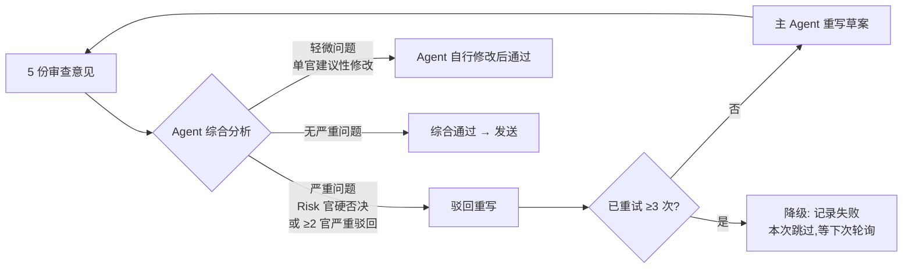

### 7.4 判决原则

1. **Risk 官有"硬否决权"**：风险审查官明确标"高风险"时必须驳回
2. **关系推进官主导策略方向**：感情推进审查官的策略建议必须被采纳
3. **邀约窗口官可触发邀约流程**：检测到窗口时，Agent 基于 Wiki 知识 + 用户日程自主生成邀约方案
4. **拟人度+用户风格官提修改建议**：这两个角度通常给"修改后通过"，而非硬否决
5. **Agent 综合裁决**：5 份意见汇总后，Agent 自己判断是"通过/修改后通过/驳回重写"
6. **3 次重试上限**：超过 3 次仍无法通过 → 记录失败原因，本次跳过，等待下一轮轮询

### 7.5 委员会确认偏差防护（v3 改进 — 我的 v2 P1-1，v4 P2 实现）

**问题**：同一 Agent 扮演 5 个审查官，可能存在确认偏差（自己写的草案自己审查容易放过）。

**改进方案**（v4 P2 已实现，见 `skill/committee/`）：

1. **5 官均用 subagent 隔离**：主 agent 通过 Task 工具开 5 个 subagent（并行），每个 subagent 扮演一个审查官。subagent 与主 agent 不共享上下文，通过控制 prompt 透露的信息实现确认偏差防护（不需不同 LLM 模型）。用户原话："负责发送的那个 agent 开数个 subagent，每个 subagent 扮演一个角色"
2. **信息隔离矩阵**：每个审查官只接收其角度所需的信息（详见 `skill/committee/README.md`）
3. **强制对抗性审查**：Risk 官必须列出至少 2 个潜在风险点才能通过
4. **7 类风险判定标准**：禁忌话术 / 需求感过强 / 可被截图 / 过度暴露 / 阶段错位 / 频率违规 / 信息泄露
5. **5 类错失窗口判定**：IOI 未响应 / 服从性未利用 / 邀约窗口错过 / 升级窗口错过 / 情绪高点未利用

**实现文件**（`skill/committee/`）：
- `README.md` — 设计说明 + 信息隔离矩阵 + 主 agent 编排示例 + 综合裁决规则
- `humanlike.md` — 拟人度审查官 prompt 模板
- `consistency.md` — 用户一致性审查官 prompt 模板（5 项检查）
- `progression.md` — 感情推进审查官 prompt 模板（4 维度 + 策略主导权）
- `risk.md` — 风险审查官 prompt 模板（7 类风险 + 硬否决权 + 强制对抗性审查）
- `invite_window.md` — 邀约窗口审查官 prompt 模板（4 类窗口检测 + 置信度评估）

### 7.6 委员会与对话线索的协作

| 审查官     | 线索字段用途                                                 |
| ------- | ------------------------------------------------------ |
| 拟人度审查官  | 检查回复是否与 recent\_summary 中的用户风格一致                       |
| 用户一致性审查官 | 检查回复是否与 user\_profile\_fact + bad\_patterns + recent\_summary 匹配      |
| 感情推进审查官 | 检查回复是否推进 pending\_items + 参考 her\_emotion.trend        |
| 风险审查官   | **对照 avoid\_topics 禁忌列表** + 检查 landmine\_topics        |
| 邀约窗口审查官 | 读取 current\_threads 检查是否有邀约话题 + 检查 initiative\_tracker |

### 7.7 失败退避策略（v4 新增）

**问题**：3 次重试都失败后，如何处理？下一轮轮询的间隔策略是什么？

**失败原因分类**：

| 失败原因                                           | 处理方式                            | 下一轮轮询间隔                 |
| ---------------------------------------------- | ------------------------------- | ----------------------- |
| **委员会审查不通过**（3 次重试均驳回）                         | 记录失败原因，本次跳过                     | 等下次对方再发消息（不主动重试）        |
| **硬约束校验失败**（线索过期/冷却中）                          | Agent 先补读线索/等待冷却，然后重试           | 立即重试（补读后）或等冷却结束         |
| **wechat\_send 发送失败**（视觉自动化异常）                 | 记录异常，通知用户（server\_chan\_notify） | 30 分钟后重试一次，仍失败则等下次对方发消息 |
| **MCP 工具调用失败**（person\_sync/wiki\_context 等超时） | 降级为无 Wiki 参考的纯数据决策              | 立即重试（降级模式）              |
| **wechat\_ocr 意图验证失败**（发送内容与预期不符）              | 记录异常，通知用户，**不自动重试**             | 等用户手动处理                 |

**退避策略总表**：

| 场景         | 退避策略                  | 理由                    |
| ---------- | --------------------- | --------------------- |
| 委员会 3 次不通过 | 不主动重试，等对方下次发消息        | 避免纠缠同一话题，可能策略方向有误     |
| 发送失败（技术原因） | 30 分钟后重试 1 次，仍失败则通知用户 | 技术故障可能短期恢复            |
| 硬约束失败      | 修复后立即重试（补读线索/等冷却）     | 硬约束是保护机制，不是错误         |
| 工具超时       | 降级重试（去掉超时的工具）         | 部分能力可用比完全不动好          |
| 意图验证失败     | 停止自动操作，通知用户           | 可能是剪贴板残留/输入法干扰，需要人工检查 |

**连续失败保护**：

- 同一联系人在 24 小时内连续失败 ≥ 3 次 → 暂停该联系人的自动回复，在每日汇报中通知用户
- 用户可通过 talk.md 手动恢复：`恢复 <name> 的自动回复`

**Wiki 依据**：失败处理参考 [频率操作手册](../docs/wiki/wiki/entities/频率操作手册.md) — 不纠缠、不死磕，保持框架稳定性。

### 7.8 幂等/取消/冲突状态机（v4 补充 3 — codex.md 建议 4）

> **目的**：明确 4 个工程不变量，避免实现时出现重复发送、无法停止、数据冲突、盲目重试等问题。

#### 7.8.1 消息幂等性（防重复发送）

**不变量**：同一条对方消息（message_id 唯一）在整个生命周期内最多触发一次自动回复。

**状态机**：

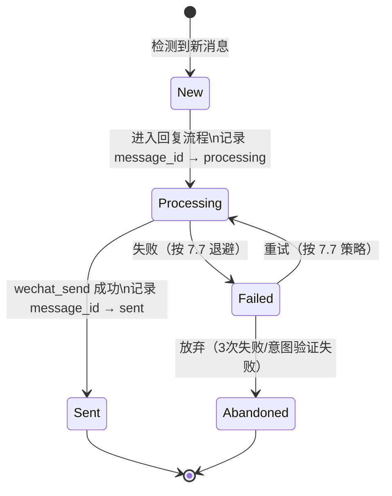

**实现要点**：
- `conversation_thread` 维护 `processed_message_ids` 列表（最近 7 天）
- 进入回复流程前先检查 `message_id` 是否已在列表中
- 发送成功/失败/放弃都记录最终状态
- 列表定期清理（> 7 天的记录自动删除）

**幂等检查伪代码**：

```python
def should_process(message_id: str) -> bool:
    """检查是否应该处理该消息（幂等性）"""
    thread = conversation_thread(action="get", name=contact)
    if message_id in thread.processed_message_ids:
        return False  # 已处理过，跳过
    return True
```

#### 7.8.2 用户介入取消（手动接管）

**不变量**：用户手动发送消息后，自动回复立即停止当前联系人的所有待执行操作。

**触发条件**（任一满足即触发）：
1. `wechat_send` 检测到用户手动发送（通过 OCR 对比最后发送内容 vs 委员会通过内容）
2. `live_chat_read` 检测到用户在微信中手动输入（输入框有未发送文字）
3. 用户在 talk.md 中写入 `停止 <name> 的自动回复`
4. 用户在 talk.md 中写入 `[[EMERGENCY_STOP_ASK_USER]]`（全局停止）

**取消流程**：

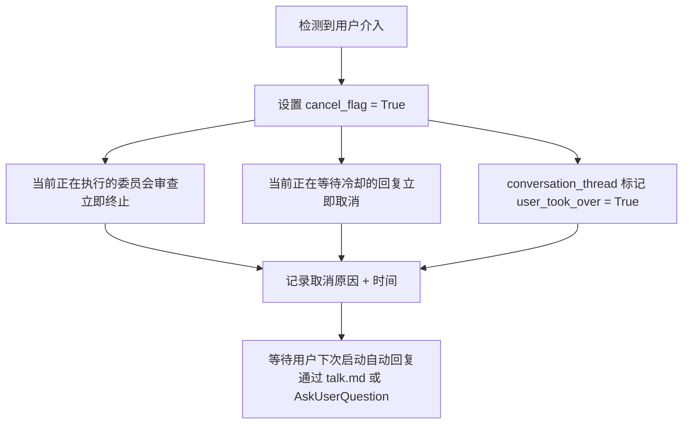

**实现要点**：
- `conversation_thread` 新增 `user_took_over` 字段（boolean + timestamp）
- 轮询循环每次检查 `cancel_flag`，True 则跳过本次回复
- `wechat_send` 在发送前检查 `cancel_flag`（v4 补充 5：作为硬约束 0，最高优先级），True 则拒绝发送
- 用户通过 talk.md 恢复时清除 `cancel_flag` 和 `user_took_over`
- v4 补充 5：`conversation_thread(action='clear_cancel_flag')` action 用于清除接管标记
- v4 补充 5：`wechat_send` 返回 `USER_TOOK_OVER` 错误码 + `hard_constraints.user_took_over: "failed"`

#### 7.8.3 conversation_thread 版本冲突处理

**不变量**：并发写入 conversation_thread 不会丢失数据。

**问题场景**：
- 主 Agent 正在更新 conversation_thread
- 同时 override_learning 也要写入 conversation_thread
- 两个写入冲突会导致后写者覆盖前写者的数据

**处理方案**：乐观锁 + 字段级合并

```python
def update_thread(name: str, updates: dict, expected_version: int):
    """乐观锁更新"""
    current = load_thread(name)
    if current.version != expected_version:
        # 版本冲突，执行字段级合并
        merged = merge_fields(current, updates)
        # 重试一次
        return update_thread(name, merged, current.version)
    else:
        # 版本匹配，直接写入
        updates["version"] = expected_version + 1
        save_thread(name, updates)
        return {"success": True, "version": updates["version"]}
```

**字段级合并规则**（v4 补充 5 修订，与实现一致）：
- `recent_summary` / `current_threads` / `key_context`：追加模式（不覆盖）
- `her_emotion`：trajectory 追加去重，current_state/trend 按 last_updated 取最新
- `initiative_tracker`：按 last_updated 取最新（若有）
- `landmine_topics` / `avoid_topics`：并集（去重）
- `pending_items`：按 item_id（或 description）去重合并

**实现要点**：
- conversation_thread YAML 文件包含 `version: int` 字段
- 每次写入前读取当前版本，写入时版本 +1
- 冲突时按字段级规则合并，最多重试 3 次（MAX_CONFLICT_RETRIES=3）
- 3 次仍冲突 → 记录冲突日志到 `data/system/thread_conflicts.log`，使用最后读取的版本强制写入（保留两份冲突日志供 Agent 审查）

#### 7.8.4 发送失败重试策略（完整状态机）

**不变量**：发送失败的重试有明确的上限和退避，不会无限重试。

**完整状态机**：

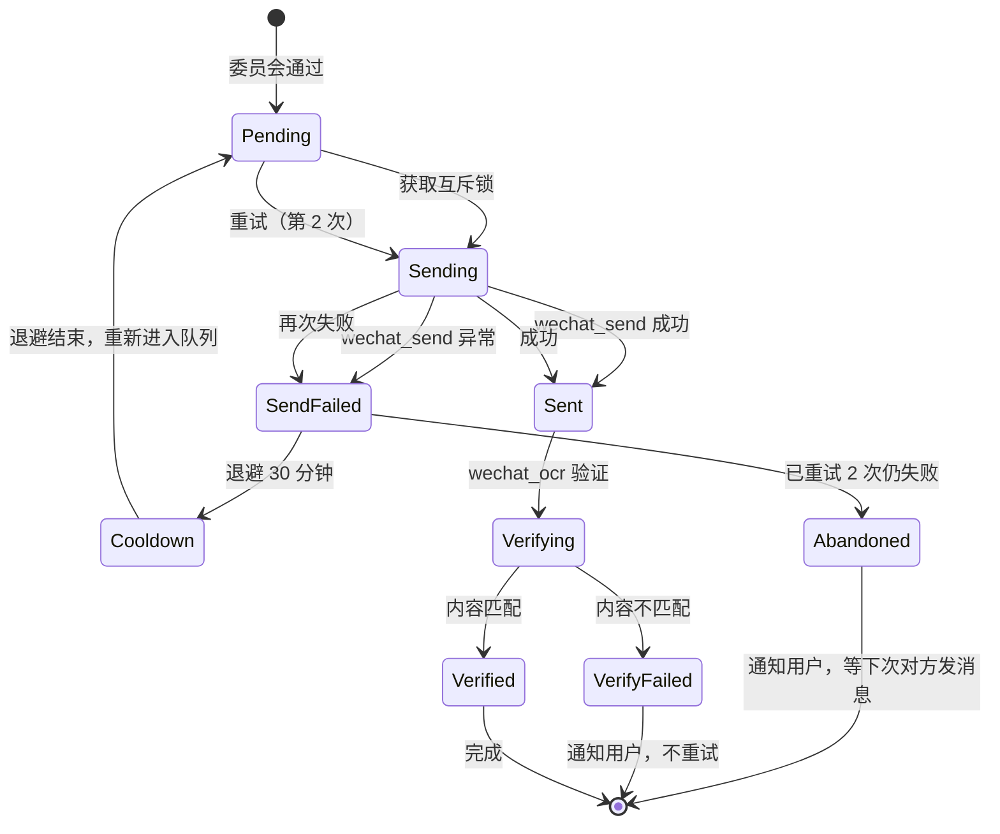

**重试上限表**：

| 失败类型 | 最大重试次数 | 退避间隔 | 放弃后处理 |
|---------|-----------|---------|----------|
| wechat_send 异常 | 2 次 | 30 分钟 | 通知用户，等下次对方发消息 |
| 委员会审查不通过 | 3 次 | 无（立即重写） | 跳过本次，等下次对方发消息 |
| 硬约束校验失败 | 1 次 | 等冷却/补读线索 | 修复后立即重试 |
| 工具调用超时 | 1 次 | 无（立即降级） | 降级模式重试 |
| 意图验证失败 | 0 次 | 无 | 通知用户，不重试 |

**实现要点**：
- 每条回复维护 `retry_count: int` 和 `last_retry_at: timestamp`
- 重试次数达上限后标记 `abandoned: True`
- abandoned 的回复不会在后续轮询中重新处理（除非用户手动触发）

**工具实现**（v4 补充 5 新增）：通过 `reply_state_manage` 工具实现 Agent 行为层状态机

| action | 何时调用 | 说明 |
|--------|---------|------|
| `record` | 进入回复流程时 | 记录新回复状态（pending），幂等性检查 |
| `update` | 发送结果后 | 更新状态，自动判断是否 abandoned |
| `check_retry` | 重试前 | 按失败类型上限 + 退避时间判断是否可重试 |
| `check_suspended` | 轮询前 | 检查联系人是否被暂停（24h 内连续失败 ≥ 3 次） |
| `clear_suspended` | 用户通过 talk.md 恢复时 | 清除暂停状态 |
| `stats` | 定期汇报时 | 统计失败率/放弃率/暂停次数（客观统计，不做归因） |

- 数据存储：`data/system/reply_states.yaml`
- 状态值：pending / sending / sent / failed / abandoned
- 明确不做：❌ 不决策"该不该重试" ❌ 不执行重试 ❌ 不生成退避策略建议 ❌ 不做归因分析

***

## 八、Wiki 知识贯穿全程（v3 整合版）

### 8.1 每个环节的 Wiki 注入点

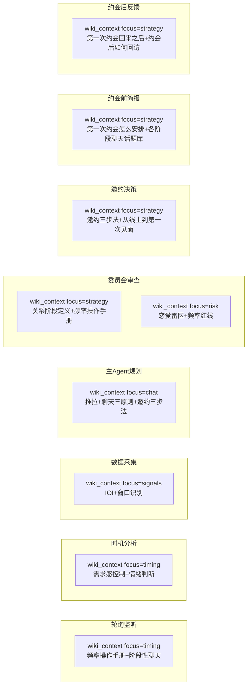

### 8.2 Wiki 调用映射表

| 环节         | wiki\_context focus | 核心 Wiki 条目                                                                                                                           | 用途            |
| ---------- | ------------------- | ------------------------------------------------------------------------------------------------------------------------------------ | ------------- |
| 轮询间隔       | timing              | [频率操作手册](../docs/wiki/wiki/entities/频率操作手册.md)                                                                                       | 按关系阶段校准间隔     |
| 时机分析       | timing              | [阶段性聊天](../docs/wiki/wiki/entities/阶段性聊天.md) + [需求感控制](../docs/wiki/wiki/entities/需求感控制.md)                                          | 判断是否秒回/延迟/分段  |
| 数据采集       | signals             | [IOI（兴趣指标）](../docs/wiki/wiki/entities/IOI（兴趣指标）.md) + [窗口识别](../docs/wiki/wiki/entities/窗口识别.md)                                    | 解读信号含义        |
| 主 Agent 规划 | chat                | [推拉](../docs/wiki/wiki/entities/推拉.md) + [聊天三原则](../docs/wiki/wiki/entities/聊天三原则.md) + [邀约三步法](../docs/wiki/wiki/entities/邀约三步法.md) | 指导回复内容        |
| 感情推进审查     | strategy            | [关系阶段定义](../docs/wiki/wiki/entities/关系阶段定义.md) + [频率操作手册](../docs/wiki/wiki/entities/频率操作手册.md)                                      | 判断是否符合阶段策略    |
| 风险审查       | risk                | [恋爱雷区](../docs/wiki/wiki/entities/恋爱雷区.md) + [频率红线](../docs/wiki/wiki/entities/频率操作手册.md)                                            | 识别禁忌话术        |
| 邀约决策       | strategy            | [邀约三步法](../docs/wiki/wiki/entities/邀约三步法.md) + [从线上到第一次见面](../docs/wiki/wiki/scenarios/从线上到第一次见面.md)                                 | 判断邀约时机 + 生成话术 |
| 约会前简报      | strategy            | [第一次约会怎么安排](../docs/wiki/wiki/scenarios/第一次约会怎么安排.md) + [各阶段聊天话题库](../docs/wiki/wiki/entities/各阶段聊天话题库.md)                           | 生成约会报告        |
| 约会后反馈      | strategy            | [第一次约会回来之后](../docs/wiki/wiki/scenarios/第一次约会回来之后.md) + [约会后如何回访](../docs/wiki/wiki/scenarios/约会后如何回访.md)                            | 指导后续策略        |
| 静默断联       | strategy            | [冷场激活手册](../docs/wiki/wiki/entities/冷场激活手册.md) + [删除你的女人重新激活](../docs/wiki/wiki/entities/删除你的女人重新激活.md)                              | 重新激活策略        |

### 8.3 Wiki 三层引用策略（v3 保留 — 我的 v2）

| 层次     | 角色                       | Wiki 引用                 |
| ------ | ------------------------ | ----------------------- |
| 委员会审查层 | 5 个审查官                   | 各自引用对应 Wiki 实体          |
| 时机分析层  | Agent 自主调用 wiki\_context | 频率法则 + 阶段性聊天 + 需求感控制    |
| 邀约规划层  | Agent 自主调用 wiki\_context | 邀约三步法 + 约会地点分级 + 约会类型分类 |

### 8.4 检索策略

复用 `wiki_context` 工具 + 预定义 query 列表：

```python
# 委员会审查的预定义 query
COMMITTEE_QUERIES = {
    "拟人度": ["聊天风格", "语言习惯", "AI痕迹识别"],
    "用户风格": ["个性化表达", "口头禅", "emoji使用"],
    "感情推进": ["关系阶段", "频率法则", "窗口识别", "推拉技术"],
    "风险": ["恋爱雷区", "需求感控制", "禁忌话术", "失败案例"],
    "邀约窗口": ["IOI", "服从性测试", "邀约时机", "阶段转换"]
}

# 邀约决策的预定义 query
DATE_PLAN_QUERIES = [
    "邀约三步法", "聊天三原则", "约会地点分级",
    "约会类型分类", "第一次约会怎么安排", "给台阶技术",
    "转场策略", "窗口识别", "假进词识别与化解", "各阶段聊天话题库"
]
```

### 8.5 降级方案

| 场景               | 降级策略                                                                   |
| ---------------- | ---------------------------------------------------------------------- |
| Wiki 检索失败        | 使用内置的简化版 Wiki 摘要（ hardcoded 在 Skill 文档中）                               |
| wiki\_context 超时 | 只使用 person\_stage + person\_signals 的数据驱动决策                            |
| Wiki 内容与事实矛盾     | **事实优先**（project\_memory 约束：LLM Agent 必须优先知识来自 OKF Wiki，但事实数据库的客观事实优先） |
| Wiki 引用条目不存在     | 记录到 Issue.md，降级为无 Wiki 参考的纯数据决策                                        |

***

## 九、跨联系人内容查重（v3 新增 — Claude #3）

### 9.1 问题背景

用户同时管理多个关系，Agent 不能把对 A 说的话稍作修改就对 B 说。这会显得敷衍/复制粘贴，破坏拟人度。

### 9.2 解决方案：recent\_replies 池

```yaml
# 文件路径: data/system/recent_replies.yaml
recent_replies:
  - time: 2026-07-22 14:30
    to: "小迎仔"
    summary: "问了蚊子咬的情况"
    pattern: "关心身体状况"
  - time: 2026-07-22 15:00
    to: "玉玺"
    summary: "吐槽实验室熬夜"
    pattern: "共情工作辛苦"
  - time: 2026-07-22 18:00
    to: "alice"
    summary: "推荐了一家咖啡店"
    pattern: "推荐场所"
```

### 9.3 查重流程

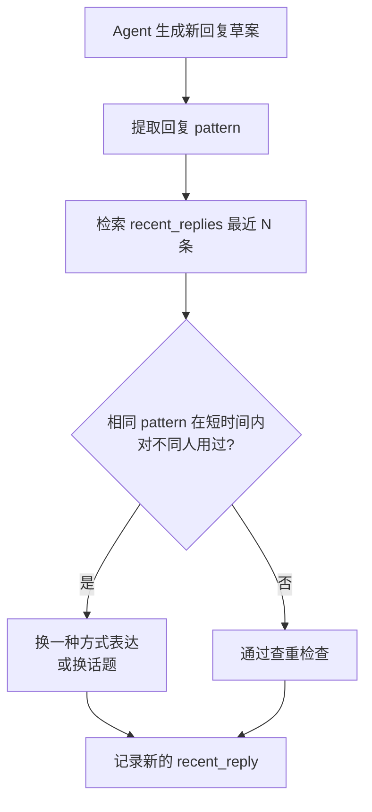

### 9.4 MCP 工具

**工具名**：`recent_replies_check`

**参数**：

```python
{
  "action": "check|add|query",
  "reply_content": "...",  # check 时使用
  "to": "[REDACTED]",
  "pattern": "关心状况",  # add 时使用
  "time_range_hours": 24  # check 时使用，默认查最近 24 小时
}
```

**返回**：

- `check`：`{"duplicate_found": bool, "matched_replies": [...], "suggestion": "换一种方式"}`
- `add`：操作结果
- `query`：匹配的回复列表

### 9.5 查重规则

1. **pattern 匹配**：提取回复的意图 pattern（如"关心状况"/"推荐场所"/"共情辛苦"）
2. **时间窗口**：默认查最近 24 小时
3. **跨联系人**：只对不同联系人的相同 pattern 报警（对同一联系人重复 pattern 是正常的）
4. **严重程度**：
   - 完全相同的话术 → 高危，必须换
   - 相同 pattern 不同措辞 → 中危，建议换
   - 不同 pattern → 通过

***

## 十、邀约决策组件（v3 深化版）

### 10.1 邀约窗口检测工具（date\_window\_detect）

> **设计原则**：工具返回客观数据和 Wiki 参考，Agent 自主决策是否邀约。不预设决策流程图。
>
> **定位**：`date_window_detect` 是数据提供者，只返回客观数据（窗口强度、IOI 信号、邀约历史、被拒次数），是否邀约由 Agent 自主决策。

**核心 Wiki 依据**（工具内部参考，用于计算 window\_strength）：

- [关系阶段定义](../docs/wiki/wiki/entities/关系阶段定义.md)：阶段停留时间预警
- [从线上到第一次见面](../docs/wiki/wiki/scenarios/从线上到第一次见面.md)：两周法则
- [窗口识别](../docs/wiki/wiki/entities/窗口识别.md)：好感窗口 vs 防感窗口
- [IOI（兴趣指标）](../docs/wiki/wiki/entities/IOI（兴趣指标）.md)：兴趣信号
- [她一直聊但不见面](../docs/wiki/wiki/scenarios/她一直聊但不见面.md)：聊得久但约不出 = 兴趣不足，需检测此风险信号

**工具规格**：

```python
date_window_detect(name: str) -> dict
```

**输入**：

- `name`：联系人名称

**工具内部实现逻辑**（不暴露给 Agent）：

1. 调用 `person_stage(name)` 获取关系阶段 + 停留时间
2. 调用 `person_signals(name)` 获取 IOI 信号强度
3. 调用 `events_save` 查询邀约历史（从未邀约/被拒次数/已约见）
4. 综合 Wiki 知识计算窗口强度

**返回**：

```python
{
  "name": "[REDACTED]",
  "is_window": true,              # 是否处于邀约窗口
  "window_strength": "strong",    # strong / medium / weak / none
  "stage_info": {
    "current_stage": 3,
    "stage_duration_days": 12,    # 当前阶段停留天数
    "stage_timeout_warning": false # 是否接近阶段超时
  },
  "ioi_level": "strong",          # strong / medium / weak
  "ioi_signals": ["主动分享日常", "回复快", "提到周末有空"],
  "invite_history": {
    "total_invites": 0,
    "rejected_count": 0,
    "last_invite_date": null,
    "status": "never_invited"     # never_invited / rejected / dated / active
  },
  "wiki_ref": {
    "strategy": "邀约三步法",
    "scenario": "从线上到第一次见面",
    "rules": ["两周法则", "70%频率法则"],
    "risk_scenario": "她一直聊但不见面"
  },
  "suggestion": "test_invite"     # test_invite / retry / maintain / stop_loss / none
                                # 仅作参考，Agent 自主决策
}
```

**Agent 使用方式**：

- Agent 调用 `date_window_detect(name)` 获取客观数据
- Agent 结合对话线索（conversation\_thread）中的 current\_threads / her\_emotion / pending\_items 自主判断
- Agent 自主决定是否邀约、用什么话术、何时邀约
- 特殊情况（对方出差/生病/忙）由 Agent 结合对话线索判断，工具不强制

### 10.2 邀约三阶递进（基于 Wiki 邀约三步法）

> **设计原则**：三阶递进描述的是邀约话术的类型层次，Agent 自主判断当前处于哪个阶段并选择话术。不预设阶段判断流程。

**三阶话术类型**（Agent 根据对话线索自主选择）：

| 阶段      | 描述             | 话术示例                      | 自动发送?     |
| ------- | -------------- | ------------------------- | --------- |
| 1. 埋线   | 在日常聊天中自然植入见面种子 | "这家店的拿铁真的绝了，有机会你一定要试试"    | ✅ 可自动     |
| 2. 模糊邀约 | 抛出不带具体时间的邀约试探  | "对了上次说的那家店，哪天一起去尝尝？"      | ✅ 可自动     |
| 3. 确定邀约 | 确定具体时间地点的邀约    | "那周六下午怎么样？我查了一下那个展三点之后人少" | ❌ 必须与用户讨论 |

**Agent 使用方式**：

- Agent 调用 `date_window_detect(name)` 获取邀约窗口数据 + `conversation_thread(name)` 获取对话线索
- Agent 自主判断当前处于哪个邀约阶段（从未邀约/已埋线/模糊邀约正面）
- 阶段 1-2：Agent 生成话术 → 委员会审查 → 可自动发送
- 阶段 3：Agent 通过 AskUserQuestion 与用户讨论时间地点 → 查用户日程 + 优先级协调 → 生成确定邀约话术 → 委员会审查后发送

**Wiki 依据**：[邀约三步法](../docs/wiki/wiki/entities/邀约三步法.md)

### 10.3 邀约方案生成（Agent 自主生成）

**原则**：邀约方案（时间/地点/活动）由 Agent 基于 Wiki 知识 + `schedule_manage` 查询的用户日程 + `person_*` 数据自主生成，不设计专门的邀约方案工具。

**Agent 生成邀约方案的依据**：

- `wiki_context(focus=strategy)` 注入的邀约三步法、从线上到第一次见面、约会地点分级等知识
- `schedule_manage(action="query")` 返回的用户可用时段
- `person_stage` / `person_signals` / `person_evidence` 返回的联系人状态
- `conversation_thread` 中的 `key_context`（个性化邀约话术）

**确定邀约必须与用户讨论**：Agent 生成方案后，通过 AskUserQuestion 与用户确认时间/地点/活动，用户确认后 Agent 按邀约三步法执行。

### 10.4 约会前简报组件

**触发时机**：

- 用户确认确定邀约后 → Agent 生成约会前简报
- 约会前 1 天 → Agent 主动提醒用户并输出简报

**简报内容结构**（5 段式）：

```markdown
# 约会前简报：[REDACTED]
## 约会时间：2026-07-25 周六 14:00

### 一、关系发展阶段
- 当前阶段: 高频聊天（阶段 3）→ 即将进入已约见（阶段 4）
- 停留时间: 12 天（正常范围 5-14 天）
- 热度趋势: 上升（回复率 0.85，主动率 0.4）
- Wiki 依据: [[关系阶段定义]] + [[频率操作手册]]

### 二、这次约会要注意什么
- 核心目标: 建立肢体接触 + 识别窗口 + 创造下次见面的理由
- Wiki 依据: [[第一次约会怎么安排]]
- 注意事项:
  1. 不要面对面坐，选择并排或 L 型
  2. 从见面就引入社交性接触（拍肩、碰手臂）
  3. 全程观察 [[窗口识别]] 信号
  4. 时间控制在 1-2 小时，在她还开心时结束
  5. 避免话题：技术、前任、政治、宗教

### 三、可讨论的话题
- Wiki 依据: [[各阶段聊天话题库]]
- 从对话线索的 current_threads 提取延续话题
- 从 person_evidence 提取她的兴趣点

### 四、需要交流的信息
- 从事实档案提取: 上次她说在准备的项目/她提过想学摄影
- 需要补充了解的: 她的周末安排/对什么活动感兴趣

### 五、约会后计划
- Wiki 依据: [[第一次约会回来之后]]
- 当晚 30-60 分钟内发消息
- 保持聊天频率
- 3-7 天内约第二次
- Agent 会在约会后询问反馈
```

**MCP 工具**：`date_briefing(name, date_plan)`

### 10.5 约会后反馈循环组件

**触发方式**：混合触发 — 日程时间到点提醒 + 用户手动触发

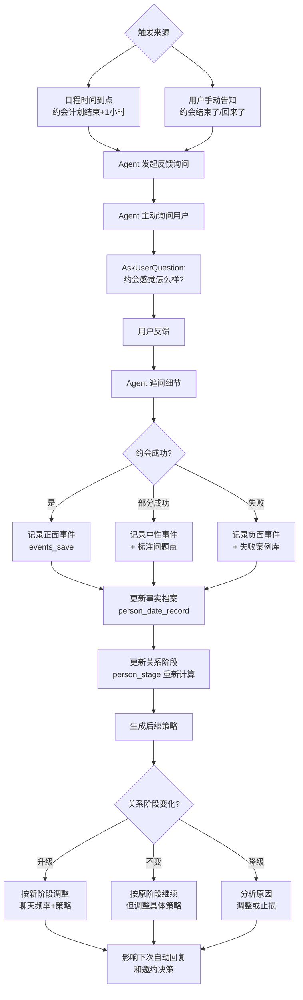

**约会后询问的关键问题**：

1. **整体感觉**：约会总体怎么样？（好/一般/不好）
2. **对方反应**：她的态度如何？（热情/平淡/冷淡）
3. **肢体接触**：有没有肢体接触？进展到什么程度？
4. **关键信号**：有没有观察到特别的好感信号或警示信号？
5. **下次意向**：还想约第二次吗？（想/不确定/不想）

**数据更新**：

- `person_date_record`：约会详情
- `events_save`：关键事件
- `person_note`：Agent 观察和用户反馈要点
- `person_save_analysis`：更新分析（关系阶段可能变化）
- `conversation_thread`：更新 key\_context + her\_emotion

**Wiki 依据**：[第一次约会回来之后](../docs/wiki/wiki/scenarios/第一次约会回来之后.md) — 黄金窗口 2-6 小时

### 10.6 优先级与回复边界

**核心原则**：优先级影响**约会安排顺序**，但不机械影响**每条消息的回复及时性**。回复间隔由 [频率操作手册](../docs/wiki/wiki/entities/频率操作手册.md) 按各自关系阶段决定。

**按阶段的回复间隔表**：

| 关系阶段          | 推荐回复间隔     | 主动率    | Wiki 依据       |
| ------------- | ---------- | ------ | ------------- |
| Stage 1 初识    | 1-3 小时     | ≤70%   | 阶段 1：每天 1-2 轮 |
| Stage 2 基本互动  | 30 分钟-2 小时 | 60-70% | 阶段 2：每天 1-3 轮 |
| Stage 3 高频聊天  | 5-30 分钟    | 50-60% | 阶段 3：每天 2-5 轮 |
| Stage 4 已约见   | 5-15 分钟    | 50-60% | 见面后保持频率       |
| Stage 5+ 持续接触 | 自然频率       | 自然     | 不需要刻意管理       |

**多联系人并发规则**：

- 每个联系人**独立**按其关系阶段的频率间隔回复，不受其他联系人优先级影响
- 优先级仅在以下场景生效：
  1. **邀约安排冲突**：多个联系人需邀约但用户时段有限 → 高优先级先安排
  2. **约会前简报**：高优先级联系人约会前简报更详细
  3. **风险预警**：高优先级联系人窗口关闭时优先通知用户
- **不做的**：不因 A 优先级高就延迟回复 B

**优先级分数计算**：

```python
priority_score = (
    stage_score * 0.3 +        # 关系阶段
    window_score * 0.3 +       # 窗口强度
    trend_score * 0.2 +        # 热度趋势
    user_eval_score * 0.1 +    # 用户主观评价
    urgency_score * 0.1        # 紧急度
)
```

**优先级管理工具**：`contact_priority_manage`

> **定位**：优先级分数由 Agent 基于 `person_stage` / `person_signals` / `person_metrics` 数据自主计算，工具负责持久化管理（设置/查询/调整用户主观评价权重）。

**工具规格**：

```python
contact_priority_manage(
    action: str,               # get / list / set_eval / set_override / reset
    name: str = None,          # 联系人名称（get/set_eval/set_override/reset 时使用）
    user_eval: str = None,     # 用户主观评价（high/medium/low），set_eval 时使用
    override_score: float = None,  # 手动覆盖分数（0-1），set_override 时使用
    reason: str = None         # 调整原因，记录到日志
) -> dict
```

**返回**：

- `get`：`{"name": "...", "score": 0.75, "breakdown": {...}, "user_eval": "high", "override": null}`
- `list`：`[{"name": "...", "score": 0.75, "rank": 1}, ...]`（按分数降序）
- `set_eval` / `set_override` / `reset`：操作结果

**Agent 使用方式**：

- Agent 调用 `contact_priority_manage(action="get", name="[REDACTED]")` 获取某联系人优先级
- Agent 调用 `contact_priority_manage(action="list")` 获取所有联系人优先级排序
- 用户通过 talk.md 告诉 Agent "[REDACTED] 优先级高" → Agent 自主理解并调用 `set_eval`
- 分数计算由 Agent 完成（基于 person\_\* 数据），工具只负责持久化 user\_eval 和 override

### 10.7 用户日程规划组件

> **定位**：`schedule_manage` 是纯 CRUD 时间占位工具，不做自然语言解析，不做冲突检测（冲突由 Agent 自己判断）。已安排的约会直接视为该时段不可用（占位），避免重复安排。

**日程数据来源决策**（v4 明确记录）：

| 方案            | 描述                                | 优点                 | 缺点                         | 是否采用         |
| ------------- | --------------------------------- | ------------------ | -------------------------- | ------------ |
| A. 事实档案       | 从 `person_date_record` 扫描已安排约会    | 零外部依赖              | 只能看到 Agent 安排的约会，看不到用户真实日程 | ❌ 不够全面       |
| B. 用户告诉 Agent | 用户通过 talk.md 或对话告诉 Agent 可用时间     | 简单可控，符合 Agent 化身原则 | 需要用户主动维护                   | ✅ **MVP 采用** |
| C. 系统日历集成     | 通过 Outlook/Google Calendar API 读取 | 实时准确               | 需要权限和集成工作                  | 📋 P2 扩展     |

**MVP 方案（B）的数据流**：

1. 用户告诉 Agent："我周二周三没空，周末下午可以"
2. Agent 自主理解并调用 `schedule_manage(action="update_preferences", ...)`
3. 邀约时 Agent 调用 `schedule_manage(action="query")` 查询可用时段
4. Agent 基于可用时段 + Wiki 邀约三步法自主生成邀约方案
5. 确定邀约时 Agent 调用 `schedule_manage(action="add", ...)` 记录约会

**P2 扩展（C）**：集成系统日历 API，自动同步用户真实日程，减少手动维护负担。

**支持 action 列表**：`query / add / update / remove / list_slots / update_preferences / add_note`

**事件 ID 格式**：`evt_{timestamp}_{person}`，例如 `evt_20260722_[REDACTED]`

**日程数据模型**：

```python
{
  "user_preferences": {
    "available_times": [
      {"weekday": "周一", "time_range": "19:00-22:00"},
      {"weekday": "周二", "time_range": "不可用"}
    ],
    "preferred_date_duration": "2小时",
    "preferred_date_types": ["咖啡", "散步", "展览"]
  },
  "scheduled_events": [
    {
      "date": "2026-07-25",
      "time": "14:00-16:00",
      "person": "[REDACTED]",
      "activity": "咖啡+散步",
      "location": "XX咖啡店",
      "priority": "high",
      "status": "confirmed",
      "created_by": "agent",
      "wiki_ref": "[[邀约三步法]]"
    }
  ],
  "user_notes": [
    "我周二周三没空，其他时间随便安排",
    "下周有出差，周末回来"
  ]
}
```

**MCP 工具**：`schedule_manage(action, date, event, preference, note)`

**日程数据更新方式**：用户直接告诉 Agent 安排和偏好（如"我周二三没空"），Agent 自主理解并调用 `schedule_manage(action="update", ...)` 写入数据。不搭建额外的自然语言解析层。

***

## 十一、用户案例库组件（v3 新增）

### 11.1 用户案例库的定位

**与用户风格画像的区别**：

- 用户风格画像：**怎么说话**（聊天风格、用词、句长、emoji）
- 用户案例库：**是什么人**（人设、职业、爱好、生活状态）

**用途**：

- 委员会"用户一致性审查官"不仅看聊天风格，还看用户人设（fact）+ 避免坏习惯（bad_patterns）
- 约会前简报：推荐符合用户人设的约会活动
- 自动回复：回复内容要符合用户人设（程序员 vs 文艺青年）
- 邀约话术：邀约的活动要符合用户爱好

### 11.2 用户案例库数据结构

```python
user_profile = {
  "identity": {
    "name": "用户",
    "age_range": "20-30",
    "occupation": "程序员",
    "education": "本科",
    "location": "北京"
  },
  "lifestyle": {
    "hobbies": ["编程", "健身", "摄影", "咖啡"],
    "interests": ["AI", "技术", "电影", "音乐"],
    "lifestyle_tags": ["技术宅", "有审美", "自律"]
  },
  "dating_preferences": {
    "preferred_date_types": ["咖啡", "展览", "散步", "健身房"],
    "avoid_date_types": ["KTV", "酒吧"],
    "budget_range": "中等",
    "time_preference": "周末下午"
  },
  "communication_style": {
    "tone": "理性+偶尔幽默",
    "vocabulary_level": "技术词汇+日常用语",
    "emoji_style": "少用，偶尔用 😂 🤔",
    "response_style": "直接+简洁"
  },
  "assets": {
    "photos": [
      {"path": "data/user_assets/photos/01.jpg", "tag": "健身", "description": "健身房自拍"},
      {"path": "data/user_assets/photos/02.jpg", "tag": "摄影", "description": "风景摄影作品"}
    ],
    "videos": [
      {"path": "data/user_assets/videos/01.mp4", "tag": "运动", "description": "篮球片段"}
    ]
  },
  "historical_patterns": {
    "successful_topics": ["技术趣事", "电影讨论", "健身"],
    "failed_topics": ["政治", "前任"],
    "personal_stories": []
  }
}
```

### 11.3 用户案例库的初始化

**混合方式**：Agent 主动询问基本信息 + 自动提取补充

**第一步：Agent 主动询问基本信息**（启动时一次性完成）

- 通过 AskUserQuestion 询问核心信息：
  1. 职业 + 行业
  2. 年龄段
  3. 核心爱好 2-3 个
  4. 约会偏好
  5. 沟通风格自评

**第二步：自动提取补充**（后台异步）

- 扫描用户与所有联系人的历史聊天，提取：
  - 高频关键词（反映真实兴趣）
  - 成功话题 / 失败话题
  - 常用 emoji 和句式

**第三步：素材库建立**（用户自愿提供）

- Agent 提示用户："如果你有想分享的生活照/视频，可以放到 data/user\_assets/ 目录"

### 11.4 用户案例库的 MCP 工具（v4 补充 4 修订 — 支持三类画像文件）

**工具名**：`user_profile_manage`

**v4 补充 4 修订**：原设计只管理单一"用户案例库"，v4 补充 4 拆分为三类画像文件后，本工具需同时管理三类文件。

**参数**：

```python
{
  "action": "get|update|add_asset|query_assets|add_bad_pattern|mark_pattern_corrected|reset_style_override",
  "profile_type": "fact|style|bad_patterns",  # v4 补充 4 新增：指定操作哪类画像
  "section": "basic_info|hobbies|values|experiences|contact_specific_experiences|material_library|  # fact 的 section
             |vocabulary|sentence_style|emoji_usage|response_pattern|tone_features|  # style 的 section
             |patterns|learned_from",  # bad_patterns 的 section
  "data": {...},
  "asset": {"path": "...", "tag": "...", "description": "..."},  # 仅 add_asset/query_assets 用
  "pattern_name": "太讨好|太解释|太秒回|太工具人|过度自我贬低",  # 仅 add_bad_pattern/mark_pattern_corrected 用
  "contact": "wxid_xxx"  # 操作联系人特化层时指定
}
```

**三类文件的操作映射**：

| profile_type | 文件 | 允许的 action | 说明 |
|--------------|------|--------------|------|
| `fact` | `data/user_profile_fact.yaml` | get/update/add_asset/query_assets | 用户事实画像，重要输入 |
| `style` | `data/user_style_profile.yaml` + `data/user_style_overrides/<wxid>.yaml` | get/update/reset_style_override | 用户表达风格，弱辅助 |
| `bad_patterns` | `data/user_bad_patterns.yaml` | get/add_bad_pattern/mark_pattern_corrected | 用户坏习惯，避免模仿 |

**关键约束**：
- `fact` 类型更新时需记录变更历史（版本管理）
- `style` 类型更新时受防过拟合机制约束（7.2.7 节）
- `bad_patterns` 类型添加时需标注 confidence 和 source
- `mark_pattern_corrected` 标记某坏习惯已纠正，不删除记录但标记状态

### 11.5 持续更新

- 每次约会后反馈循环中，更新 successful\_topics / failed\_topics
- 用户主动告诉 Agent 新的爱好或生活变化
- Agent 在自动回复过程中发现新的用户特征

***

## 十二、定期汇报组件（v3 新增）

### 12.1 汇报类型

| 类型         | 触发                | 内容                  | 输出方式                        |
| ---------- | ----------------- | ------------------- | --------------------------- |
| **每日汇报**   | 每天固定时间（如 22:00）   | 今天和谁聊了、关键对话、邀约进展    | AskUserQuestion 或文本输出       |
| **每周汇报**   | 每周固定时间（如周日 20:00） | 本周关系进展、热度变化、下周建议    | 文本输出 + save\_from\_markdown |
| **事件驱动汇报** | 关键事件发生时           | 邀约成功/失败、关系阶段升级、风险预警 | AskUserQuestion 立即通知        |

### 12.2 触发机制

Agent 内部维护定时器（伪代码）：

```python
class ReportScheduler:
    def __init__(self):
        self.daily_report_time = "22:00"
        self.weekly_report_time = "SUN-20:00"
        self.event_queue = []

    def tick(self):
        now = datetime.now()
        if now.strftime("%H:%M") == self.daily_report_time and not self.daily_report_done_today:
            self.generate_daily_report()
            self.daily_report_done_today = True
        # ... 每周 + 事件驱动
```

**实现要点**：

1. **依赖 Agent 持续运行**：定时器在 Agent 进程内
2. **幂等保护**：每日/每周汇报标记 done，防止重复触发
3. **时间可配置**：用户可通过 `schedule_manage` 调整
4. **事件驱动优先**：关键事件立即汇报，不等定时器
5. **汇报时间智能避让**：如果用户正在和某联系人热聊，延迟到对话间隙
6. **Agent 重启补报**（v3 改进）：如果 Agent 重启后发现错过了汇报时间，在下次启动时补报

### 12.3 每日汇报示例

```markdown
## 今日自动回复汇报 (2026-07-22)

### 活动概览
- 监听联系人数: 3
- 自动回复次数: 5
- 邀约进展: 1 个确定邀约（[REDACTED]，周六下午）

### 关键对话
1. [REDACTED]:
   - 她主动分享日常（强 IOI）
   - Agent 回复: "哈哈那家店确实不错，下次一起去"
   - 委员会审查: 5/5 通过

2. alice:
   - 她回复变慢（3小时）
   - Agent 判断: 中性，未回复
   - 策略: 等待，明天再互动

### 需要您决策的事项
- [REDACTED] 周六约会，需要确认地点
```

### 12.4 紧急事件推送（Server酱）

> **设计原则**：Agent 自主判断事件紧急程度，调用 `server_chan_notify` 工具推送。不预设事件分级规则。

**场景**：用户不在 Trae IDE 前面（如外出、睡觉、工作），Agent 检测到需要立即通知的紧急事件，通过 Server酱推送消息到用户微信。

**与定期汇报的区别**：

- 定期汇报（12.1-12.3）：按时间触发，内容全面，通过 AskUserQuestion/文本输出
- 紧急事件推送（12.4）：按事件触发，内容简短，通过 Server酱推送到微信

**MCP 工具**：`server_chan_notify(title, content, priority)`

**工具规格**：

```python
server_chan_notify(title: str, content: str, priority: int = 2) -> dict
```

**参数**：

- `title`：通知标题（简短，≤32 字）
- `content`：通知内容（Markdown 格式，支持简单排版）
- `priority`：事件优先级（0=low, 1=medium, 2=high, 3=critical）

**工具内部逻辑**（不暴露给 Agent）：

1. 读取 `config.yaml` 中的 `serverchan` 配置
2. 如果 `enabled=false` 或 `sckey` 为空 → 跳过，返回 `{"sent": false, "reason": "disabled"}`
3. 如果 `priority < min_priority` → 跳过，返回 `{"sent": false, "reason": "below_threshold"}`
4. HTTP POST 到 `https://sctapi.ftqq.com/{sckey}.send`（Server酱 Turbo 版）
5. 返回发送结果

**返回**：

```python
{
  "sent": true,
  "priority": 2,
  "timestamp": "2026-07-22T14:30:00",
  "serverchan_response": {"code": 0, "message": "ok"}
}
```

**Agent 使用方式**：

- Agent 自主判断事件紧急程度，决定是否调用 `server_chan_notify`
- Agent 自主决定 `priority` 值（不预设分级规则）
- 参考场景（非硬性规则）：
  - 邀约窗口开启/邀约成功 → Agent 自主判断是否紧急
  - 对方情绪突变/断联风险 → Agent 自主判断是否紧急
  - 委员会连续驳回 3 次 → Agent 自主判断是否通知用户
  - 系统异常/工具故障 → Agent 自主判断是否通知

**配置**（`data/system/config.yaml`）：

```yaml
serverchan:
  enabled: true
  sckey: ""                    # 用户在 https://sct.ftqq.com/ 注册后填入
  min_priority: 2              # 只有 priority >= 2 的事件才推送
```

***

## 十三、手动覆盖学习闭环（v3 新增 — Claude #6）

### 13.1 问题背景

用户可能会自己手动回复（用手机），绕过 Agent。这是宝贵的"强化学习"信号——用户实际怎么说的，比委员会审查更有说服力。

### 13.2 检测流程

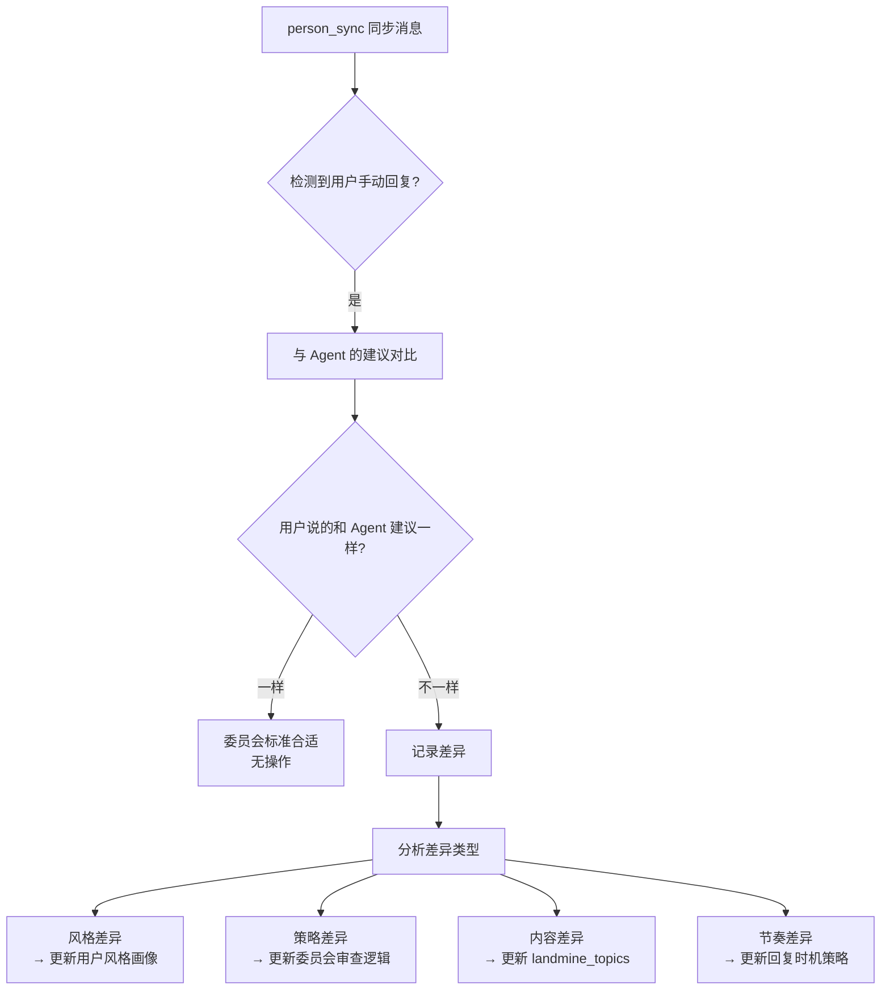

### 13.3 学习信号记录

```yaml
# 文件路径: data/system/override_learning.yaml
override_events:
  - time: 2026-07-22 15:30
    person: "[REDACTED]"
    agent_suggestion: "周末有空吗？想约你喝咖啡"
    user_actual: "周六下午怎么样？我找到一家不错的店"
    diff_type: "strategy"
    diff_analysis: "用户更直接，不模糊邀约"
    learning_action: "更新该联系人的邀约策略偏好为'直接'"
    applied: false  # 是否已应用到委员会审查
```

### 13.4 应用学习信号

1. **风格差异**：更新 `user_style_profile` 的画像数据（重新跑前置批处理脚本）
2. **策略差异**：在 `conversation_thread` 中记录该联系人的策略偏好
3. **内容差异**：如果用户避免了 Agent 建议的话题，加入 `landmine_topics`
4. **节奏差异**：Agent 自主调整后续回复节奏（参考 `person_metrics` 的历史间隔分布）

***

## 十四、效果追踪组件（v3 新增 — Claude #7）

### 14.1 问题背景

发完不是结束。Agent 应该追踪每条自动发送的回复效果，建立"委员会通过率 vs 实际效果"的对比，帮用户判断委员会标准过严还是过松。

### 14.2 追踪流程

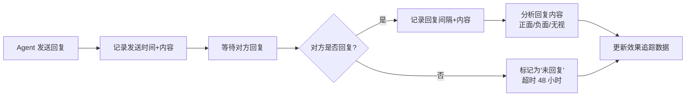

### 14.3 效果数据结构

```yaml
# 文件路径: data/system/effect_tracking.yaml
effect_records:
  - send_time: 2026-07-22 14:30
    person: "[REDACTED]"
    message_type: "auto_reply"  # auto_reply / initiative / invitation
    message_summary: "推荐咖啡店"
    committee_result: "5/5 通过"
    response_received: true
    response_time: 300  # 秒
    response_sentiment: "positive"  # positive / neutral / negative / no_response
    response_summary: "她说也想去试试"
    effectiveness_score: 0.9  # 0-1
```

### 14.4 效果评估指标

| 指标               | 定义                | 目标     |
| ---------------- | ----------------- | ------ |
| **回复率**          | 对方回复的自动消息 / 总自动消息 | > 80%  |
| **平均回复间隔**       | 对方回复的平均时间         | 符合阶段预期 |
| **正面回复率**        | 正面情感回复 / 总回复      | > 60%  |
| **委员会通过率 vs 效果** | 委员会高分的消息效果是否更好    | 正相关    |
| **邀约成功率**        | 邀约成功 / 邀约尝试       | > 30%  |

### 14.5 委员会标准自优化

基于效果追踪数据，定期评估委员会标准：

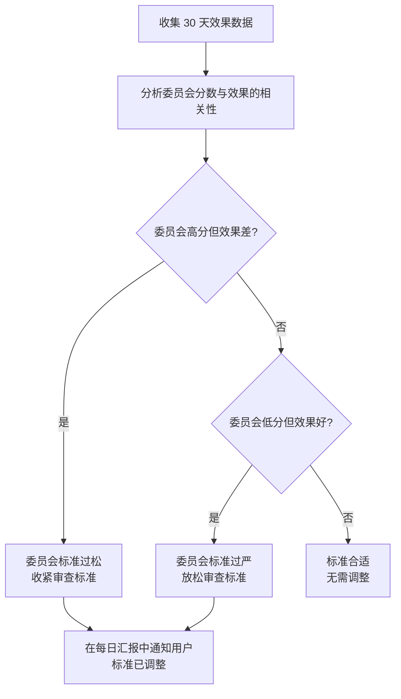

***

## 十五、Agent 承认"不知道"的机制（v3 新增 — Claude #5）

### 15.1 问题背景

目前 Agent 的回复永远是"胸有成竹"的语气。但有些情况确实不知道：

- 对方提到一个 context 里没有的话题
- 不知道对方的周末安排
- 不了解某个梗

### 15.2 解决方案

允许 Agent 生成"模糊回应"模板：不假装知道，但也不直接说"我不知道"，而是用好奇/反问语气。

**模糊回应模板**：

| 场景         | 不好的回复         | 好的模糊回应            |
| ---------- | ------------- | ----------------- |
| 对方提了不知道的事  | "哦那个啊" (假装知道) | "这个我还真不太了解，详细说说？" |
| 对方问了不知道的安排 | "我不知道" (太直接)  | "这个还没定，你有什么想法吗？"  |
| 对方发了不理解的梗  | "哈哈" (敷衍)     | "没get到笑点，解释一下？"   |

**实现方式**：在 Skill 文档中指导 Agent，当检测到对话线索中没有相关信息时，使用模糊回应模板。

***

## 十六、多媒体发送能力（v3 保留）

### 16.1 当前能力

| 能力        | 实现文件                  | 状态                         |
| --------- | --------------------- | -------------------------- |
| **文本发送**  | send\_message\_run.py | ✅ 已实现                      |
| **表情包发送** | send\_emoji\_run.py   | ✅ 已实现                      |
| **图片发送**  | 待实现                   | 🔨 方案已明确（复用剪贴板机制，80% 代码复用） |
| **视频发送**  | 待评估                   | 📋 P2 优先级                  |

### 16.2 图片发送方案

**核心洞察**：图片发送可复用文本发送的剪贴板机制，只需把剪贴板内容从文字换成图片。

```
文本发送:  input_text_via_clipboard(hwnd, text)  → 剪贴板放文字 → Ctrl+V
图片发送:  input_image_via_clipboard(hwnd, image_path) → 剪贴板放图片 → Ctrl+V
```

**预估工作量**：新增 `send_image_run.py`（约 100-150 行），核心只是 `input_image_via_clipboard` 函数（约 30 行）

### 16.3 v3 补充：图片发送的决策逻辑

不只是技术实现，还需要决策逻辑：

1. **何时发送图片**：对方要求 / 展示面建设 / 分享生活
2. **发送什么图片**：从用户素材库选择（user\_profile\_manage.assets）
3. **发送频率控制**：不过度发送，参考 [展示面建设](../docs/wiki/wiki/entities/展示面建设.md)
4. **与展示面建设的关联**：图片内容应符合用户人设

***

## 十七、能力清单总览（v3 完整版）

### 17.1 现有 MCP 工具（复用）

| 能力      | 工具                                                                                                                 | 状态                     |
| ------- | ------------------------------------------------------------------------------------------------------------------ | ---------------------- |
| 数据采集    | person\_sync / person\_brief / person\_chat / person\_metrics / person\_signals / person\_stage / person\_evidence | ✅                      |
| Wiki 知识 | wiki\_context / wiki\_search / wiki\_read                                                                          | ✅                      |
| 实时监听    | live\_monitor\_start / live\_chat\_read / live\_monitor\_stop                                                      | ✅                      |
| 微信发送    | wechat\_send（文本）/ send\_emoji\_run（表情包）/ wechat\_ocr                                                               | ✅（文本+表情包）/ 🔨（图片方案已明确） |
| 约会后记录   | person\_date\_record / events\_save / save\_from\_markdown / person\_note                                          | ✅                      |
| 周报      | weekly\_report                                                                                                     | ✅（部分可复用）               |

### 17.2 需要新增的 MCP 工具（v3 完整清单）

| #  | 工具名                       | 功能                                                           | 优先级   | 来源                       |
| -- | ------------------------- | ------------------------------------------------------------ | ----- | ------------------------ |
| 1  | `conversation_thread`     | 对话线索管理（get/update/catch\_up/add\_landmine/add\_avoid\_topic） | P0 核心 | v2（另一 agent）+ Claude Pro |
| 2  | `date_briefing`           | 约会前简报生成                                                      | P0    | v2（另一 agent）             |
| 3  | `schedule_manage`         | 用户日程管理（纯 CRUD）                                               | P0    | v2（另一 agent）             |
| 4  | `recent_replies_check`    | 跨联系人内容查重                                                     | P1    | Claude #3                |
| 5  | `user_profile_manage`     | 用户案例库管理                                                      | P1    | v2（另一 agent）             |
| 6  | `date_feedback_loop`      | 约会后反馈循环                                                      | P1    | v2（另一 agent）             |
| 7  | `effect_tracking`         | 效果追踪                                                         | P1    | Claude #7                |
| 8  | `override_learning`       | 手动覆盖学习                                                       | P2    | Claude #6                |
| 9  | `server_chan_notify`      | 紧急事件推送（Server酱 → 微信）                                         | P0    | v3 修订                    |
| 10 | `contact_priority_manage` | 联系人优先级管理（get/list/set\_eval/set\_override）                   | P1    | v4 新增                    |

> **注**：`user_style_profile` 不是 MCP 工具，而是前置批处理产物（`scripts/user_style_profile.py` 启动前执行一次），生成 `data/user_style_profile.yaml` 供 Agent 读取。

### 17.3 wechat\_send 硬约束增强（v3 关键，v4 补充 5 修订为四重）

`wechat_send` 不只是发送工具，还集成四重硬约束（v4 补充 5 修订）：

0. **用户介入取消校验**（v4 补充 5 新增，最高优先级）：`conversation_thread.user_took_over == False`
1. **线索已读校验**：`last_processed_message_id >= latest_message_id`
2. **回复冷却校验**：按阶段最小冷却
3. **互斥锁校验**：视觉自动化串行

发送后增加：
4\. **意图一致性验证**：wechat\_ocr 比对发送内容 vs 委员会通过内容

### 17.4 实现分级表（v4 补充 3 — codex.md 建议 3）

> **目的**：明确每个能力的实现状态，避免把"计划"当"现状"。

| 能力 | 状态 | 实现位置 | 备注 |
|------|------|---------|------|
| **数据采集层** | ✅ 已有 | `mcp_server/tools_read.py` + `engine/agent/` | person_sync/brief/chat/metrics/signals/stage/evidence |
| **Wiki 知识层** | ✅ 已有 | `mcp_server/tools_read.py` + `engine/knowledge/` | wiki_context/search/read |
| **实时监听** | ✅ 已有 | `mcp_server/tools_live.py` + `engine/live_monitor/` | live_monitor_start/stop/status/read |
| **微信发送（文本+表情）** | ✅ 已有 | `mcp_server/tools_wechat.py` + `engine/wechat_sender/` | wechat_send/emoji/ocr，含互斥锁 |
| **归档** | ✅ 已有 | `mcp_server/tools_write.py` + `engine/tools.py` | save_from_markdown/person_save_analysis |
| **事件检测** | ✅ 已有 | `mcp_server/tools_write.py` | events_scan/save |
| **现有 workflow** | ✅ 已有 | `skill/mcp_index.yaml` | analysis/emergency_reply/weekly/maintain |
| **对话线索管理** | ✅ 已有 | `mcp_server/tools_thread.py` | conversation_thread（P0），含乐观锁 + 字段级合并 + clear_cancel_flag |
| **日程管理** | ✅ 已有 | `mcp_server/tools_schedule.py` | schedule_manage（P0） |
| **用户档案管理** | ✅ 已有 | `mcp_server/tools_profile.py` | user_profile_manage（P0） |
| **约会前简报** | ✅ 已有 | `mcp_server/tools_date.py` | date_briefing（P0） |
| **跨联系人查重** | ✅ 已有 | `mcp_server/tools_replies.py` | recent_replies_check（P0） |
| **wechat_send 硬约束增强** | ✅ 已有 | `mcp_server/tools_wechat.py` | 四重硬约束（v4 补充 5：含 user_took_over 校验） |
| **auto_reply workflow** | ✅ 已有 | `skill/mcp_index.yaml` | 3 个新 workflow |
| **约会后反馈闭环** | ✅ 已有 | `mcp_server/tools_date.py` | date_feedback_loop（P1） |
| **效果追踪** | ✅ 已有 | `mcp_server/tools_replies.py` | effect_tracking（P1） |
| **手动覆盖学习** | ✅ 已有 | `mcp_server/tools_override.py` | override_learning（P1） |
| **Server酱推送** | ✅ 已有 | `mcp_server/tools_notify.py` | server_chan_notify（P1） |
| **优先级管理** | ✅ 已有 | `mcp_server/tools_priority.py` | contact_priority_manage（P1） |
| **回复状态管理** | ✅ 已有 | `mcp_server/tools_reply_state.py` | reply_state_manage（v4 补充 5 新增，Agent 行为层状态机） |
| **用户风格批处理** | ✅ 已有 | `scripts/user_style_profile.py` | 前置批处理（P1），已运行生成画像 |
| **用户风格特化层** | ✅ 已有 | `data/user_style_overrides/` + `tools_profile.py` | 联系人特化 YAML，user_profile_manage 管理 |
| **多媒体发送（图片/视频/文件）** | ✅ 已有 | `mcp_server/tools_wechat.py` + `engine/wechat_sender/send_image_run.py` | 图片发送（CF_DIB）+ 视频/文件发送（CF_HDROP，P2-6/P2-7 已实现） |
| **系统日历集成** | ❌ 未做 | 待评估 | schedule_manage 方案 C（P2） |
| **跨进程互斥锁** | ✅ 已有 | `engine/wechat_sender/cross_process_lock.py` | Win32 Named Mutex（P2），替代 threading.Lock |
| **委员会审查 subagent 隔离** | ✅ 已有 | `skill/committee/`（6 个文件） | 5 官 prompt 模板 + 信息隔离矩阵 + JSON 输出格式 + 主 agent 编排示例（P2），已端到端验证（2 轮审查+发送成功） |
| **消息发送自动切分** | ✅ 已有 | `mcp_server/tools_wechat.py` | split_message_for_wechat 删除标点+emoji 并分段，模拟真人微信发送习惯 |
| **WM_IME_CHAR 中文逐字输入** | ✅ 已有 | `engine/wechat_sender/human_sim.py` | USE_IME_CHAR_FOR_CHINESE=True，PostMessageW 绕过剪贴板逐字输入（随机间隔 0.08-0.25s） |
| **聊天窗口复用** | ✅ 已有 | `engine/wechat_sender/wechat_e2e_run.py` | _check_already_in_chat_window 预检查，跳过阶段一/二直接进入阶段三 |
| **混合连续发送** | ✅ 已有 | `engine/wechat_sender/wechat_e2e_run.py` | send_message_batch 支持 text/emoji/image/video/file 混合消息连续发送 |
| **person_behaviors 联动** | ❌ 未做 | 待评估 | 语义分析辅助信号（P2） |
| **Server酱 sendkey 配置** | ✅ 已配置 | `data/system/config.yaml` | sckey 已填入，enabled=true |
| **WCD/WeFlow 后端** | ⚠️ 依赖外部 | `D:\WeFlow\WeFlow.exe` 等 | 自动回复依赖后端运行 |

***

## 十八、关键设计决策汇总（v3 完整版）

| #  | 决策点                                   | 选择                                                                                                             | 理由                                                  | 来源                         |
| -- | ------------------------------------- | -------------------------------------------------------------------------------------------------------------- | --------------------------------------------------- | -------------------------- |
| 1  | Agent 框架                              | 复用外部 Agent                                                                                                     | 不做新框架                                               | v1                         |
| 2  | 委员会实现                                 | 5 官均为 Task 工具 subagent（prompt 差异化）                                                                               | 不做独立 agent 进程，但用 subagent 隔离防确认偏差                          | v1 → v4 修订（P2 实现）         |
| 3  | 归档策略                                  | Skill 指导用现有工具                                                                                                  | 不做独立 auto\_reply\_log                               | v1                         |
| 4  | 多联系人并发                                | 多 Agent 并发 + 微信操作互斥                                                                                            | 数据层并发，微信串行                                          | v1                         |
| 5  | 互斥锁                                   | threading.Lock（同进程）                                                                                            | 简单有效，跨进程用 portalocker                               | v1                         |
| 6  | 轮询间隔                                  | **10 秒固定轻量轮询 + 消息完整性检测触发回复**（区分 her\_send\_gap 和 user\_reply\_gap）                                                | v1 直接基于对方间隔触发会打断连发或冷场，v4 改为完整性检测+应回间隔               | v1 → v4 修订（advise.md P0-2） |
| 7  | 深夜处理                                  | **分时段降频**（23-02 30s/次, 02-06 2min/次, 06-08 30s/次）+ 紧急豁免 + 关键词通知 + 联系人作息                                      | v1 完全不轮询会漏紧急消息，v4 改为降频+豁免                              | v1 → v4 修订（advise.md P1-5） |
| 8  | 时机分析                                  | Agent 自主决策（不设计专门工具）                                                                                            | Agent 是用户化身，自己判断时机                                  | v1 → v4 修订                 |
| 9  | 委员会审查                                 | 非机械投票，Agent 综合裁决                                                                                               | 灵活应对                                                | v1                         |
| 10 | Risk 官硬否决                             | 高风险必须驳回                                                                                                        | 安全优先                                                | v1                         |
| 11 | 重试上限                                  | 3 次                                                                                                            | 避免死循环                                               | v1                         |
| 12 | 用户风格画像                                | **三类拆分**：user\_profile\_fact（grounding，高优先级）+ user\_style\_profile（smoothing，低优先级）+ user\_bad\_patterns（避免模仿，高优先级）                    | v1 完全统一会稀释个性化；v4 补充 2 双层画像会把"了解用户"误解成"复制用户"；v4 补充 4 拆分三类，fact 用于 grounding，style 用于 smoothing，bad_patterns 用于避免模仿 | v1 → v4 补充 2 → v4 补充 4（codex.md 架构修正） |
| 13 | 新增工具数                                 | 11 个（v3 扩展）                                                                                                    | 按优先级分批实现                                            | v3                         |
| 14 | 归档方式                                  | Skill 指导 + 现有工具                                                                                                | 不新增归档工具                                             | v1                         |
| 15 | Wiki 融入方式                             | 贯穿全程，每环节切换 focus                                                                                               | Wiki 是推理主轴                                          | v2（另一 agent）               |
| 16 | 邀约发送策略                                | 三阶递进（埋线/模糊可自动，确定邀约需讨论）                                                                                         | 涉及用户日程                                              | v2（另一 agent）               |
| 17 | 日程数据源                                 | Agent 自主理解用户意图 + 调用工具记录                                                                                        | 用户说"周二三没空"，Agent 自主理解并调用 schedule\_manage           | v2（另一 agent）+ v3 修订        |
| 18 | 联系人优先级                                | 基于 Wiki 阶段+窗口+趋势+用户评价                                                                                          | 协调多联系人约会安排                                          | v2（另一 agent）               |
| 19 | 约会后反馈                                 | Agent 主动询问用户 + 更新数据库                                                                                           | 影响后续决策的关键闭环                                         | v2（另一 agent）               |
| 20 | 用户案例库                                 | 人设+爱好+聊天风格+素材                                                                                                  | 区别于用户风格画像，更全面                                       | v2（另一 agent）               |
| 21 | 多媒体发送                                 | 标注为缺口，优先实现图片                                                                                                   | 展示面建设需要视觉内容                                         | v2（另一 agent）               |
| 22 | 定期汇报                                  | 每日+每周+事件驱动                                                                                                     | 用户需要了解 Agent 行为                                     | v2（另一 agent）               |
| 23 | 约会前简报                                 | 基于 Wiki 生成 5 段式报告                                                                                              | 满足用户对约会准备的需求                                        | v2（另一 agent）               |
| 24 | 约后反馈触发                                | 混合触发（日程到点 + 用户手动）                                                                                              | 防遗忘 + 不强依赖用户                                        | v2（另一 agent）               |
| 25 | 定期汇报触发                                | Agent 内部定时器 + 重启补报                                                                                             | 简单 + 防丢失                                            | v2 + v3 改进                 |
| 26 | 案例库初始化                                | 混合方式（询问 + 自动提取）                                                                                                | 兼顾准确性和效率                                            | v2（另一 agent）               |
| 27 | 优先级回复边界                               | 按 Wiki 频率匹配，优先级不影响回复及时性                                                                                        | 避免冷落低优先级                                            | v2（另一 agent）               |
| 28 | 图片发送技术方案                              | 复用文本发送剪贴板机制                                                                                                    | 80% 代码复用                                            | v2（另一 agent）               |
| 29 | 对话线索管理                                | Agent 维护线索文件，回复前必读+过期补读+回复后更新                                                                                  | 确保上下文连贯                                             | v2（另一 agent）               |
| 30 | **工具层硬约束**                            | wechat\_send 校验线索已读+回复冷却                                                                                       | 从软约束变硬约束                                            | Claude Pro #1              |
| 31 | **回复冷却机制**                            | 按阶段最小冷却（30min/5min/3min）                                                                                       | 防秒回暴露自动回复                                           | Claude Pro #2              |
| 32 | **Agent 承诺追踪**                        | 删除 conversation\_thread.my\_promises 字段，由 recent\_summary 记录                                                   | Agent 是用户化身，自己记得说过什么，不需要专门字段记录。用 recent\_summary 足够 | Claude Pro #3 → v4 修订      |
| 33 | **情绪轨迹**                              | trajectory 序列 + trend 趋势                                                                                       | 比单点状态更准确                                            | Claude Pro #4              |
| 34 | **回复后意图验证**                           | wechat\_ocr 比对发送内容                                                                                             | 防剪贴板残留/输入法干扰                                        | Claude Pro #5              |
| 35 | **静默断联处理**                            | 48h 无回复 → 诊断 + 提醒                                                                                              | 主动处理断联                                              | Claude Pro #6              |
| 36 | **短期禁忌列表**                            | conversation\_thread.avoid\_topics                                                                             | 防跨联系人混淆                                             | Claude Pro #7              |
| 37 | **已消耗话题**                             | conversation\_thread.landmine\_topics                                                                          | 防问已知答案的问题                                           | Claude #1                  |
| 38 | **消息意图理解**                            | Agent 天然能力，不搭建预分类层                                                                                             | LLM 自主判断意图并更新线索字段，不绕过 Agent                         | Claude #2 → v3 修订（改为不额外设计） |
| 39 | **跨联系人查重**                            | recent\_replies 池 + pattern 检索                                                                                 | 防复制粘贴感                                              | Claude #3                  |
| 40 | **主动发起预算**                            | initiative\_tracker                                                                                            | 关注谁先说话                                              | Claude #4                  |
| 41 | **模糊回应**                              | 承认"不知道"的模板                                                                                                     | 提升拟人度                                               | Claude #5                  |
| 42 | **手动覆盖学习**                            | 检测用户手动回复 → 记录差异 → 更新                                                                                           | 强化学习信号                                              | Claude #6                  |
| 43 | **效果追踪**                              | 委员会通过率 vs 实际效果                                                                                                 | 系统自优化                                               | Claude #7                  |
| 44 | **委员会确认偏差防护**                         | **5 官均用 subagent 隔离**（不仅 Risk 官）+ Risk 官强制对抗性审查（至少 2 个风险点）                                                              | 防自己审查自己；用户澄清"开数个 subagent 扮演各角色"                              | 我的 v2 P1-1 → v4 修订（P2 实现）  |
| 45 | **Agent 定位原则**                        | Agent=LLM=用户化身，不搭建额外语义理解层                                                                                      | 不绕过 Agent                                           | v3 修订                      |
| 46 | **紧急事件推送**                            | Server酱推送紧急事件到用户微信                                                                                             | 用户不在 IDE 前时的通知渠道                                    | v3 修订                      |
| 47 | **server\_chan\_notify 工具**           | 提供 server\_chan\_notify(title, content, priority)，Agent 自主判断紧急程度                                               | 遵循 Agent 定位原则，不预设分级规则                               | v3 修订                      |
| 48 | **Agent 化身原则扩展**                      | 所有语义理解由 Agent 完成，MCP 工具只做 CRUD/统计/系统操作。删除 reply\_timing\_analyze/user\_style\_extract/date\_plan\_propose 三个工具 | Agent 是用户化身，具备自然语言理解能力，不绕过 Agent 搭建额外语义理解层          | v4 终版                      |
| 49 | **emergency\_reply 与 auto\_reply 关系** | 两者并存，Agent 自主选择；共享对话线索文件；emergency\_reply 发送也走硬约束                                                              | 现有 emergency\_reply 不废弃，auto\_reply 是升级版            | v4 补充                      |
| 50 | **失败退避策略**                            | 按失败原因分类处理：委员会不通过→等对方下次发消息；发送失败→30分钟重试1次；意图验证失败→通知用户不重试                                                         | 不同失败原因需要不同退避策略，避免纠缠                                 | v4 补充                      |
| 51 | **连续失败保护**                            | 24h 内连续失败 ≥3 次 → 暂停该联系人自动回复，每日汇报通知用户                                                                           | 防止系统反复失败浪费资源                                        | v4 补充                      |
| 52 | **联系人优先级管理工具**                        | contact\_priority\_manage（get/list/set\_eval/set\_override），分数由 Agent 计算，工具只持久化                                | 遵循 Agent 化身原则，计算由 Agent 完成                          | v4 补充                      |
| 53 | **归档内容标准化**                           | 不做独立工具，但在 Skill 文档中规定 save\_from\_markdown 的标准化格式                                                              | 效果追踪和手动覆盖学习需要结构化数据                                  | v4 补充                      |
| 54 | **日程数据来源**                            | MVP 采用方案 B（用户告诉 Agent），P2 扩展方案 C（系统日历集成）                                                                       | 符合 Agent 化身原则，简单可控                                  | v4 补充                      |
| 55 | **mcp\_index.yaml 注册**                | 注册 3 个 workflow：auto\_reply（12步）/auto\_reply\_invite（6步）/auto\_reply\_notify（2步）                               | 明确实现时的注册格式                                          | v4 补充                      |
| 56 | **轮询间隔策略**                          | 10 秒固定轻量轮询 + 消息完整性检测触发回复，区分 her\_send\_gap 和 user\_reply\_gap                                              | v1 直接基于对方间隔会打断连发或冷场                                  | v4 补充 2（advise.md P0-2）     |
| 57 | **深夜降频统一规则**                        | 分时段降频（23-02 30s, 02-06 2min, 06-08 30s）+ 紧急豁免 + 关键词通知 + 联系人作息调整                                          | v1 完全不轮询会漏紧急消息                                       | v4 补充 2（advise.md P1-5）     |
| 58 | **用户风格双层画像**                        | 统一基准层（base）+ 联系人特化层（per\_contact override），合并后供委员会审查                                                       | v1 完全统一会稀释个性化特征                                      | v4 补充 2（advise.md P1-4）     |
| 59 | **工具契约硬约束**                          | 每个新增工具必须声明"输入/输出/不做什么"，禁止输出"该不该""什么意思"等结论                                                        | 防止工具长成半个推理层，违反 Agent 化身原则                             | v4 补充 3（codex.md 建议 2）     |
| 60 | **工程不变量**                             | 4 个不变量：消息幂等性 + 用户介入取消 + 线索版本冲突乐观锁 + 发送失败重试上限                                                          | 工程实现必须有明确规则，避免重复发送/无法停止/数据冲突/盲目重试                    | v4 补充 3（codex.md 建议 4）     |
| 61 | **上线标准**                              | MVP 上线门槛 8 项指标 + 长期运行 9 项指标 + 下线/回滚 5 个条件                                                              | 没有验收标准的系统只能凭感觉判断好坏                                    | v4 补充 3（codex.md 建议 6）     |
| 62 | **策略优先级重定义**                         | Wiki 方法论/系统分析 > 聊天上下文 > 事实档案/用户真实信息 > 联系人关系阶段 > 用户风格画像                                                              | 用户原本聊天方式可能有问题（太讨好/太秒回等），不能机械模仿；策略依据来自 Wiki 和系统分析，用户画像只是辅助 | v4 补充 4（codex.md 架构修正）     |
| 63 | **用户一致性审查官**（改名）                    | "用户风格审查官"→"用户一致性审查官"，检查 5 项：①有无编造经历 ②是否与身份冲突 ③是否人设突变 ④是否关系阶段突兀 ⑤是否保留系统策略而非退回坏习惯                                | 原名"风格审查"会误导成"像不像用户说话"，实际应检查"符合不符合用户真实人设"               | v4 补充 4（codex.md 架构修正）     |
| 64 | **四重硬约束**（升级）                         | 原三重硬约束升级为四重：新增硬约束 0（user\_took\_over 校验，最高优先级）> 硬约束 1（线索已读）> 硬约束 2（冷却）> 硬约束 3（互斥锁）                          | v4 补充 3 的 7.8.2 节定义了"用户介入取消"不变量，但原三重硬约束未包含该检查；审查发现 cancel\_flag 机制未实现（高风险），修复后升级为四重 | v4 补充 5（实现审查修复）           |
| 65 | **reply\_state\_manage 工具**（新增）          | 新建独立 MCP 工具实现 Agent 行为层状态机（重试状态机 + 失败退避 + abandoned 标记），6 个 action：record/update/check\_retry/check\_suspended/clear\_suspended/stats | 备选方案 A（内存维护）无法持久化；备选方案 B（扩展 effect\_tracking）职责混淆；采用方案 C（独立工具）职责单一，可被 Agent 在重试前/轮询前/发送后明确调用 | v4 补充 5（实现审查修复）           |

***

## 十九、改进点与优化方向（v3 整合版）

### 19.1 P0 改进点（必须实现）

#### P0-1：工具层硬约束（Claude Pro #1）

- **问题**：Skill 文档的软约束不可靠，Agent 可能偷懒跳过
- **方案**：wechat\_send 集成三重硬约束（线索已读+回复冷却+互斥锁）
- **实现**：修改 wechat\_send 工具代码

#### P0-2：回复冷却机制（Claude Pro #2）

- **问题**：秒回暴露自动回复
- **方案**：按阶段最小冷却（Stage 1-2: 30min / Stage 3: 5min / Stage 4+: 3min）
- **实现**：wechat\_send 新增 cooldown 检查

#### P0-3：对话线索管理（v2 另一 agent #29）

- **问题**：Agent 只读部分对话就回复，上下文断裂
- **方案**：conversation\_thread 工具 + 线索文件 + 过期补读
- **实现**：新增 conversation\_thread MCP 工具

### 19.2 P1 改进点（应该实现）

#### P1-1：委员会确认偏差防护（我的 v2）

- **问题**：同一 Agent 扮演 5 官，确认偏差
- **方案**：Risk 官用 subagent 隔离 + 强制对抗性审查

#### P1-2：用户风格双层画像（v4 修订 — advise.md P1-4）

- **问题**：v1 完全不分联系人的画像会稀释个性化特征；v2 仅补充人设案例库但未解决语气差异
- **v4 方案**：
  - **统一基准层**（`data/user_style_profile.yaml`）：跨联系人稳定的固有习惯（句长/口头禅/emoji 偏好）
  - **联系人特化层**（`data/user_style_overrides/<wxid>.yaml`）：按联系人调整语气/称呼/亲密度的 delta
  - **合并机制**：审查时 `merge_style(base, override)`，特化层覆盖基准层
  - **学习机制**：自动观察（对方反应冷淡）+ 手动覆盖（override_learning）+ 阶段变化触发
- **详见**：7.2 节

#### P1-3：深夜降频（v4 修订 — advise.md P1-5）

- **问题**：v1 完全不轮询过于绝对，对方深夜主动发消息不回显得冷漠，紧急情况不能漏
- **v4 方案**：分时段降频（23:00-02:00 降到 30s/次，02:00-06:00 降到 2min/次，06:00-08:00 恢复 30s/次）+ 紧急豁免（urgent=True 不受限制）+ 紧急关键词检测（"睡不着"/"难过"/"想死"等立即通知用户）+ 联系人作息调整（夜猫型/早睡型/正常型）
- **详见**：5.6 节

#### P1-4：多联系人并发（我的 v2 + v2 另一 agent）

- **问题**：多 Agent 进程跨进程锁复杂性
- **方案**：推荐单进程多线程架构 + 跨联系人查重

#### P1-5：跨联系人查重（Claude #3）

- **问题**：Agent 把对 A 的话稍改对 B 说
- **方案**：recent\_replies 池 + pattern 检索

#### P1-6：手动覆盖学习（Claude #6）

- **问题**：用户手动回复的学习信号未被利用
- **方案**：检测差异 → 记录 → 更新委员会

### 19.3 P2 改进点（可以延迟）

#### P2-1：失败恢复（我的 v2）

- **问题**：发送失败后的处理
- **方案**：通知 + 分类 + 降级 + 案例库

#### P2-2：归档模板（我的 v2）

- **问题**：归档内容格式不统一
- **方案**：标准化 Markdown 模板

#### P2-3：效果评估指标（我的 v2 + Claude #7）

- **问题**：缺乏系统效果评估
- **方案**：5 个核心指标 + 委员会标准自优化

#### P2-4：用户日历整合（我的 v2 + v2 另一 agent）

- **问题**：邀约需要用户日历
- **方案**：schedule\_manage 工具 + MVP 降级方案

#### P2-5：静默断联处理（Claude Pro #6）

- **问题**：对方 48h 无回复
- **方案**：诊断 + 提醒 + 重新激活策略

#### P2-6：图片发送（v2 另一 agent）

- **问题**：多媒体发送能力缺失
- **方案**：复用剪贴板机制 + 决策逻辑

***

## 二十、实施路线图（v3 三阶段）

### 阶段 1：MVP（最小可用版本）

**目标**：实现核心自动回复闭环

**产出**：

1. `conversation_thread` MCP 工具（P0-3）
2. `scripts/user_style_profile.py` — 前置批处理脚本（启动前执行一次）
3. `server_chan_notify` MCP 工具（Server酱紧急事件推送，`mcp_server/tools_notify.py`）
4. `schedule_manage` MCP 工具（纯 CRUD，`mcp_server/tools_schedule.py`）
5. wechat\_send 硬约束增强（P0-1 + P0-2）
6. emergency\_reply.md Skill 文档（含 5 官委员会流程）
7. mcp\_index.yaml 更新

**mcp\_index.yaml 注册格式**（v4 明确）：

```yaml
workflows:
  auto_reply:
    name: 自动回复流程
    description: 轮询监听 → 时机判断 → 线索读取 → 数据采集 → Wiki注入 → 委员会审查 → 硬约束校验 → 发送 → 归档
    steps:
      - number: 0
        name: 轮询监听
        tool: live_monitor_start
      - number: 1
        name: 时机判断
        tool: null                   # Agent 自主决策
      - number: 2
        name: 对话线索读取
        tool: conversation_thread     # 新增
      - number: 3
        name: 数据采集
        tool: person_sync
      - number: 4
        name: 全局视图
        tool: person_brief
      - number: 5
        name: Wiki 知识框架
        tool: wiki_context
      - number: 6
        name: 用户风格画像
        tool: null                   # 读取前置批处理产物 data/user_style_profile.yaml
      - number: 7
        name: 主 Agent 规划
        tool: null                   # Agent 内部推理
      - number: 8
        name: 委员会审查
        tool: null                   # Agent 内部推理（5 官）
      - number: 9
        name: 硬约束校验+发送
        tool: wechat_send
      - number: 10
        name: 意图验证
        tool: wechat_ocr
      - number: 11
        name: 归档+线索更新
        tool: save_from_markdown

  auto_reply_invite:
    name: 邀约决策流程
    description: 邀约窗口检测 → 方案生成 → 用户确认 → 委员会审查 → 发送
    steps:
      - number: 0
        name: 邀约窗口检测
        tool: date_window_detect
      - number: 1
        name: 查询用户日程
        tool: schedule_manage         # 新增
      - number: 2
        name: 邀约方案生成
        tool: null                   # Agent 自主生成
      - number: 3
        name: 用户确认
        tool: null                   # AskUserQuestion
      - number: 4
        name: 委员会审查
        tool: null
      - number: 5
        name: 发送
        tool: wechat_send

  auto_reply_notify:
    name: 紧急事件通知流程
    description: Agent 自主判断紧急程度 → Server酱推送
    steps:
      - number: 0
        name: 紧急事件检测
        tool: null                   # Agent 自主判断
      - number: 1
        name: 推送通知
        tool: server_chan_notify      # 新增
```

**实现要点**：

- 对话线索管理是核心，确保上下文连贯
- 硬约束保底，即使 Agent 偷懒也不会出错
- 委员会 5 官流程写入 Skill 文档

**验收场景**：

- 监听联系人 → 检测到新消息 → 读取线索 → 时机分析 → 数据采集 → Wiki 注入 → 委员会审查 → 硬约束校验 → 发送 → 意图验证 → 更新线索 → 归档

### 阶段 2：完善（邀约+学习+汇报）

**目标**：实现邀约决策 + 学习闭环 + 定期汇报

**产出**：

1. `date_briefing` MCP 工具
2. `user_profile_manage` MCP 工具
3. `recent_replies_check` MCP 工具（P1-5）
4. `override_learning` MCP 工具（P1-6）
5. 委员会确认偏差防护（P1-1）

**实现要点**：

- 邀约三阶递进 + 用户确认（Agent 自主生成邀约方案，不依赖 date\_plan\_propose 工具）
- 跨联系人查重 + 手动覆盖学习
- 定期汇报（每日/每周/事件驱动）

**验收场景**：

- 检测到邀约窗口 → Agent 基于 Wiki+日程自主生成邀约方案 → 用户确认 → 约会前简报 → 约会后反馈 → 更新数据库
- 用户手动回复 → 检测差异 → 更新委员会

### 阶段 3：扩展（效果追踪+多媒体+优化）

**目标**：效果追踪 + 多媒体 + 持续优化

**产出**：

1. `effect_tracking` MCP 工具（P2-3）
2. `date_feedback_loop` MCP 工具
3. 图片发送能力（P2-6）
4. 委员会标准自优化
5. 静默断联处理（P2-5）

**实现要点**：

- 效果追踪 + 委员会标准自优化
- 多媒体发送 + 决策逻辑
- 静默断联 + 重新激活

**验收场景**：

- 30 天效果数据 → 委员会标准调整 → 通知用户
- 图片发送 → 决策逻辑选择合适图片 → 发送

### 实施顺序

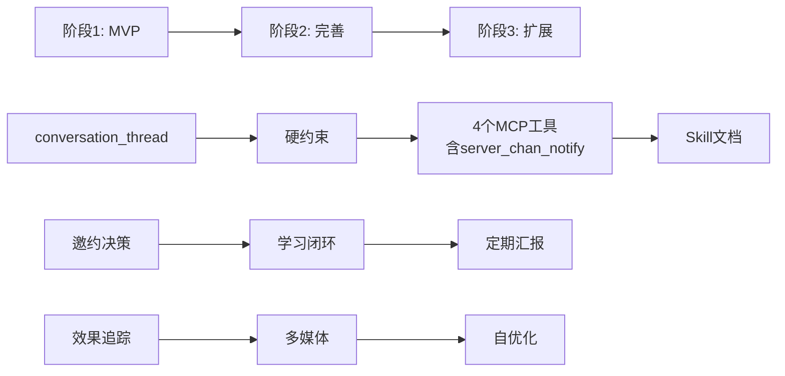

***

## 二十一、开放问题与处理状态

### 已决策

| # | 问题         | 决策                         | 理由          |
| - | ---------- | -------------------------- | ----------- |
| 1 | 定期汇报触发方式   | Agent 内部定时器 + 重启补报         | 简单 + 防丢失    |
| 2 | 用户案例库初始建立  | 混合方式                       | 询问 + 自动提取   |
| 3 | 约会后反馈触发    | 混合触发                       | 日程到点 + 用户手动 |
| 4 | 优先级协调边界    | 按 Wiki 频率匹配                | 不影响回复及时性    |
| 5 | 多媒体发送技术可行性 | 图片复用剪贴板                    | 80% 代码复用    |
| 6 | 工具层硬约束     | wechat\_send 三重校验          | 从软约束变硬约束    |
| 7 | 对话线索管理     | conversation\_thread + 硬约束 | 确保上下文连贯     |

### 待处理

| # | 问题              | 状态  | 处理方案                                            |
| - | --------------- | --- | ----------------------------------------------- |
| 1 | 用户素材库的隐私        | 待确认 | 确认 data/ 在 .gitignore + 显式添加 data/user\_assets/ |
| 2 | 跨进程互斥锁方案        | ✅ 已解决 | 采用 Win32 Named Mutex（cross_process_lock.py），无需 portalocker |
| 3 | 委员会 subagent prompt 设计 | ✅ 已解决 | 已设计 5 官 prompt 模板（`skill/committee/`）+ 信息隔离矩阵 + JSON 输出格式 + 主 agent 编排示例 |
| 4 | 对话线索的 token 消耗  | 待评估 | 线索文件塞进 context 增加 token，需优化                     |

***

## 二十二、v3 整合来源追溯

| 章节          | 来源                                          | 说明                                                      |
| ----------- | ------------------------------------------- | ------------------------------------------------------- |
| 一、定位与边界     | v1 + v3 新增                                  | 新增工具层硬约束定位                                              |
| 二、整体架构图     | v1 + v2（另一 agent）+ v3                       | 整合所有组件                                                  |
| 三、流程时序图     | v1 + v3                                     | 加入线索+硬约束+意图验证                                           |
| 四、多联系人并发    | v1 + v2（另一 agent）+ v3                       | 加入线索层+跨联系人共享层                                           |
| 五、轮询间隔+回复冷却 | v1 + Claude Pro #2 + Claude Pro #6          | 新增冷却机制+静默断联                                             |
| 六、对话线索管理    | v2（另一 agent）+ Claude #1 + Claude Pro #3,4,7 | 整合 landmine/emotion/avoid\_topics（promises 已在 v4 删除）    |
| 七、委员会审查     | v1 + v3                                     | 5 官（新增邀约窗口官）+ 确认偏差防护                                    |
| 八、Wiki 贯穿全程 | v2（另一 agent）+ 我的 v2                         | 9 环节注入 + 三层引用 + 降级方案                                    |
| 九、跨联系人查重    | Claude #3                                   | 新增                                                      |
| 十、邀约决策      | v2（另一 agent）+ 我的 v2                         | 窗口检测 + 三阶递进（date\_plan\_propose 已在 v4 删除，改由 Agent 自主生成） |
| 十一、用户案例库    | v2（另一 agent）                                | 新增                                                      |
| 十二、定期汇报     | v2（另一 agent）+ v3 改进                         | 新增重启补报                                                  |
| 十三、手动覆盖学习   | Claude #6                                   | 新增                                                      |
| 十四、效果追踪     | Claude #7 + 我的 v2 P2-3                      | 新增 + 委员会自优化                                             |
| 十五、模糊回应     | Claude #5                                   | 新增                                                      |
| 十六、多媒体发送    | v2（另一 agent）+ v3 补充                         | 新增决策逻辑                                                  |
| 十七、能力清单     | v3 完整版                                      | 11 个新增工具                                                |
| 十八、关键决策     | v1+v2+v3                                    | 44 个决策                                                  |
| 十九、改进点      | 我的 v2 + Claude + Claude Pro                 | P0×3/P1×6/P2×6                                          |
| 二十、实施路线图    | 我的 v2 + v3                                  | 三阶段                                                     |
| 二十一、开放问题    | v2（另一 agent）+ v3                            | 新增 token 消耗评估                                           |

> **v4 终版整合来源**：应用 Agent 化身原则，删除三个违反原则的工具（reply\_timing\_analyze/user\_style\_extract/date\_plan\_propose），确立 MCP 工具层只做 CRUD/统计/系统操作的边界。
>
> **v4 补充整合来源**：通过倒读"设计微信自动回复框架.md"（另一个 agent 的对话演进记录），发现并补充 7 个遗漏点：emergency\_reply 关系、失败退避策略、优先级管理工具、归档标准化、日程数据来源、mcp\_index.yaml 注册格式、"她一直聊但不见面"场景引用。

> **v4 补充 2 整合来源**：对照 advise.md（另一个 agent 对 v1 架构的分析报告，含 10 个改进点），补充 3 个未完全覆盖点：①P0-2 轮询间隔引入消息完整性检测+区分两种间隔（5.1/5.2 节）；②P1-4 用户风格画像改为双层结构（7.2 节）；③P1-5 深夜规则统一为分时段降频（5.6 节）。advise.md 已按用户指示在读取后删除。

> **v4 补充 3 整合来源**：对照 codex.md（另一个 agent 对 v4 文档的 6 点收口建议），全部补充：①建议 1 文件重命名+状态分层；②建议 2 工具契约表（第二十三章）；③建议 3 实现分级表（17.4 节）；④建议 4 幂等/取消/失败重试状态机（7.8 节）；⑤建议 5 风格画像衰减+置信度（7.2 节）；⑥建议 6 上线标准（第二十四章）。

> **v4 补充 4 整合来源**：对照 codex.md 更新（架构修正），核心修正"用户画像用于 grounding，用户风格用于 smoothing，策略依据来自 Wiki 和系统分析"。补充：①用户画像拆分三类文件（fact/style/bad\_patterns，7.2 节）；②策略优先级重定义（7.2.2 节）；③"用户风格审查官"→"用户一致性审查官"+ 5 项检查职责（7.3 节）；④user\_profile\_manage 工具规格支持三类文件（11.4 节）；⑤工具契约表 23.5 更新；⑥决策 #12 修订 + 新增 #62-63。

***

## 二十三、工具契约表（v4 补充 3 — codex.md 建议 2）

> **目的**：为每个新增工具定义硬契约，防止工具长成"半个推理层"。每个工具只允许产出客观数据或 CRUD，不输出"该不该发""她什么意思"这种结论。

### 23.1 conversation_thread

| 维度 | 内容 |
|------|------|
| **输入** | action（get/update/append_summary/clear/check_expired）+ name + 可选字段 |
| **输出** | 对话线索 YAML 数据（recent_summary / current_threads / pending_items / her_emotion / key_context / landmine_topics / avoid_topics） |
| **明确不做** | ❌ 不判断"该不该回复" ❌ 不计算"对方什么意思" ❌ 不生成回复建议 ❌ 不评估关系阶段 ❌ 不做意图分类 |

### 23.2 date_briefing

| 维度 | 内容 |
|------|------|
| **输入** | name（联系人）+ date_context（约会时间/地点，可选） |
| **输出** | 5 段式简报 Markdown（人物快照 + Wiki 指引 + 行程注意事项 + 话题储备 + 风险提醒） |
| **明确不做** | ❌ 不生成约会方案 ❌不决策"要不要赴约" ❌ 不评估约会成功概率 ❌ 不生成约会中话术 |

### 23.3 schedule_manage

| 维度 | 内容 |
|------|------|
| **输入** | action（query/add/update/remove/list_slots/update_preferences/add_note）+ 时间/事件参数 |
| **输出** | 日程事件列表 / 操作结果（成功/失败） |
| **明确不做** | ❌ 不解析自然语言日程（由 Agent 理解） ❌ 不决策"什么时候有空" ❌ 不推荐约会时间 ❌ 不冲突检测（由 Agent 判断） |

### 23.4 recent_replies_check

| 维度 | 内容 |
|------|------|
| **输入** | pattern（回复意图模式）+ time_window（时间窗口，默认 24h） |
| **输出** | 相似回复列表（联系人 + 时间 + 相似度 + 严重程度） |
| **明确不做** | ❌ 不决策"能不能发这条回复" ❌ 不生成替代回复 ❌ 不评估"复制粘贴感" ❌ 不做语义相似度计算（只做 pattern 匹配） |

### 23.5 user_profile_manage（v4 补充 4 修订 — 支持三类画像）

| 维度 | 内容 |
|------|------|
| **输入** | action（get/update/add_asset/query_assets/add_bad_pattern/mark_pattern_corrected/reset_style_override）+ profile_type（fact/style/bad\_patterns）+ section + data |
| **输出** | 对应画像文件数据 / 操作结果（成功/失败 + 变更字段） |
| **明确不做** | ❌ 不生成回复风格建议 ❌ 不决策"对这个人该用什么语气" ❌ 不评估用户人设是否合适 ❌ 不做人设优化 ❌ 不自动应用坏习惯纠正（只标记） ❌ 不决策"这条回复是否违反 bad_patterns"（由用户一致性审查官判断） |

### 23.6 date_feedback_loop

| 维度 | 内容 |
|------|------|
| **输入** | name + date_event_id + feedback_text（可选，用户手动输入） |
| **输出** | 反馈记录结果 / 待分析项列表 |
| **明确不做** | ❌ 不评估约会是否成功 ❌ 不生成改进建议 ❌ 不决策"下一步怎么做" ❌ 不做情感分析 |

### 23.7 effect_tracking

| 维度 | 内容 |
|------|------|
| **输入** | action（record/stats/report）+ time_range + contact（可选） |
| **输出** | 效果统计数据（委员会通过率 / 对方回复率 / 回复延迟 / 用户接管率） |
| **明确不做** | ❌ 不决策"系统好不好" ❌ 不生成优化方案 ❌ 不评估"哪条回复失败" ❌ 不做归因分析 |

### 23.8 override_learning

| 维度 | 内容 |
|------|------|
| **输入** | original_draft（Agent 草案）+ final_sent（用户编辑后实际发送）+ context |
| **输出** | 差异分析结果 + 学习规则候选（不直接应用，需 Agent 审核后写入 user_profile_manage） |
| **明确不做** | ❌ 不自动应用学习规则 ❌ 不决策"下次该怎么回" ❌ 不评估用户编辑好坏 ❌ 不做人设推断 |

### 23.9 server_chan_notify

| 维度 | 内容 |
|------|------|
| **输入** | title + message + level（info/warning/urgent） |
| **输出** | 推送结果（成功/失败 + 推送 ID） |
| **明确不做** | ❌ 不决策"该不该通知用户" ❌ 不生成通知内容（由 Agent 撰写） ❌ 不评估通知紧急程度 ❌ 不做通知频率控制（由 Agent 判断） |

### 23.10 contact_priority_manage

| 维度 | 内容 |
|------|------|
| **输入** | action（get/list/set_eval/set_override/reset）+ name + 可选参数 |
| **输出** | 优先级数据（user_eval / override_score / computed_priority） |
| **明确不做** | ❌ 不计算优先级分数（由 Agent 计算，工具只持久化） ❌ 不决策"先回谁" ❌ 不评估关系重要性 ❌ 不生成优先级调整建议 |

### 23.11 契约通用约束

所有 11 个新工具（v4 补充 5：原 10 + reply_state_manage）必须遵守的通用约束：

1. **只产出客观数据或 CRUD 结果**：不输出主观判断
2. **不输出"该不该"结论**：所有"该不该"决策由 Agent 完成
3. **不输出"什么意思"解读**：所有语义理解由 Agent 完成
4. **不生成回复内容**：所有回复内容由 Agent 撰写
5. **不生成策略建议**：所有策略由 Agent 基于 Wiki + 数据自主决策
6. **失败时返回客观错误信息**：不返回"建议怎么做"的提示

### 23.12 reply_state_manage（v4 补充 5 新增）

| 维度 | 内容 |
|------|------|
| **输入** | action（record/update/check_retry/check_suspended/clear_suspended/stats）+ message_id + person + state + failure_type + failure_reason + time_range_days |
| **输出** | 状态记录 / 重试判断（can_retry + retry_count + backoff_remaining）/ 暂停状态 / 统计数据（state_distribution + success_rate + abandon_rate + suspended_count） |
| **明确不做** | ❌ 不决策"该不该重试"（只提供状态数据和重试上限判断） ❌ 不执行重试（由 Agent 调用 wechat_send） ❌ 不生成退避策略建议（由 Agent 基于 7.7 节表决策） ❌ 不做归因分析（只做客观数据汇总） |

***

## 二十四、上线标准与观测指标（v4 补充 3 — codex.md 建议 6）

> **目的**：明确"什么叫成功"，没有验收标准的系统只能凭感觉判断好坏。

### 24.1 MVP 上线门槛（必须全部达成才能上线）

| # | 指标 | 阈值 | 测量方式 |
|---|------|------|---------|
| 1 | **自动发送成功率** | ≥ 95% | effect_tracking 统计：成功发送次数 / 总尝试次数 |
| 2 | **误发率**（不该发但发了） | ≤ 2% | 用户标记误发次数 / 总发送次数 |
| 3 | **重复发送率**（幂等性失败） | 0% | 同一 message_id 触发 >1 次发送的次数 |
| 4 | **用户撤回率** | ≤ 5% | 用户在发送后 5 分钟内撤回的次数 / 总发送次数 |
| 5 | **委员会通过率** | 60-90% | 通过次数 / 总审查次数（< 60% 说明过于保守，> 90% 说明审查不严） |
| 6 | **硬约束拦截率** | ≤ 10% | 硬约束拦截次数 / 总尝试次数（> 10% 说明 Agent 行为过于激进） |
| 7 | **线索过期补读准确率** | ≥ 90% | 补读后上下文完整的次数 / 总补读次数 |
| 8 | **回复冷却命中率** | ≥ 80% | 触发冷却的次数 / 应触发冷却的次数（< 80% 说明冷却机制有漏洞） |

### 24.2 长期运行指标（上线后持续观测）

| 类别 | 指标 | 健康范围 | 告警阈值 |
|------|------|---------|---------|
| **效果类** | 对方回复率（自动回复后 24h 内） | 40-80% | < 30%（可能回复质量差） |
| **效果类** | 对方回复延迟中位数 | < 用户历史平均 × 1.5 | > 用户历史平均 × 2（可能让对方觉得冷淡） |
| **效果类** | 关系阶段推进率（月） | 10-30% 联系人有阶段变化 | < 5%（可能策略过于保守） |
| **接管类** | 用户接管率（手动接管次数 / 总轮询次数） | ≤ 20% | > 40%（系统自动能力不足） |
| **接管类** | 用户接管响应时间 | < 5 分钟 | > 30 分钟（用户可能没看到通知） |
| **稳定性** | 连续失败保护触发频率 | ≤ 1 次/周/联系人 | > 3 次/周/联系人（该联系人可能有问题） |
| **稳定性** | 工具调用超时率 | ≤ 5% | > 15%（后端可能有问题） |
| **风格** | 用户风格审查驳回率 | 10-30% | > 50%（风格画像可能不准） |
| **风格** | 手动覆盖学习触发频率 | ≤ 2 次/天/联系人 | > 5 次/天/联系人（风格画像严重不准） |

### 24.3 观测指标采集方式

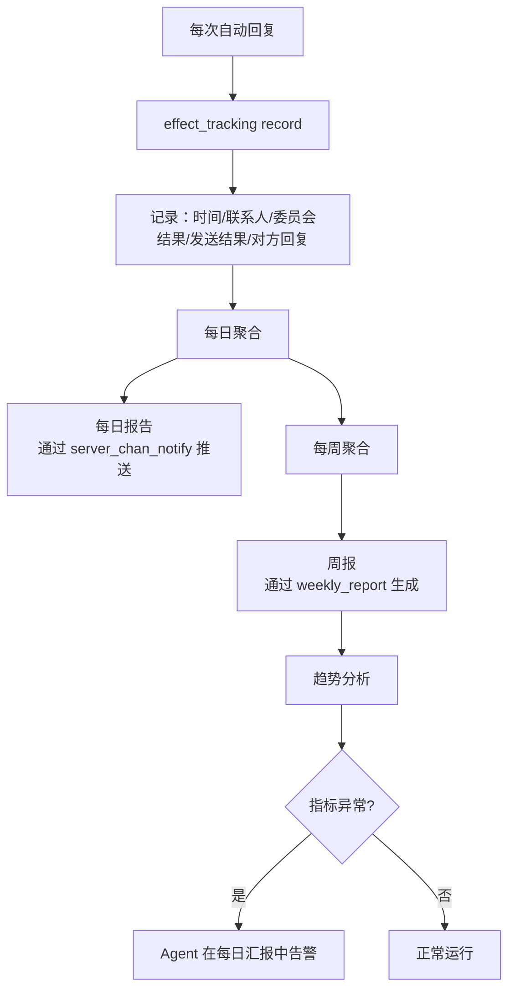

### 24.4 效果追踪数据结构

`effect_tracking` 工具记录的每条数据：

```yaml
- timestamp: "2026-07-22T15:30:00"
  contact: "alice"
  message_id: "msg_xxx"           # 触发回复的对方消息 ID
  committee:
    verdict: "通过"                # 通过/修改后通过/驳回
    retry_count: 1                # 委员会重试次数
    risk_officer_verdict: "通过"   # Risk 官单独记录
  hard_constraint:
    thread_read_check: "passed"   # 线索已读校验
    cooldown_check: "passed"      # 回复冷却校验
    mutex_check: "passed"         # 互斥锁校验
  send:
    success: true
    elapsed_ms: 3500
    retry_count: 0
  verify:
    ocr_match: true               # 意图验证结果
  outcome:
    her_replied: true             # 对方是否回复
    her_reply_delay_min: 15       # 对方回复延迟（分钟）
    user_took_over: false         # 用户是否手动接管
    user_revoked: false           # 用户是否撤回
```

### 24.5 上线评审流程

1. **内测阶段**（1 周）：仅用户自己使用，不接入真实联系人
   - 验证：硬约束全部生效 + 委员会审查流程跑通 + 无重复发送
2. **灰度阶段**（1 周）：接入 1-2 个低优先级联系人
   - 验证：MVP 上线门槛 8 项指标全部达标
3. **全量阶段**：接入所有联系人
   - 持续观测长期运行指标，每周 review

### 24.6 下线/回滚条件

任一条件满足立即停止自动回复：
- 误发率 > 5%（连续 3 天）
- 重复发送率 > 0%（任何一次）
- 用户接管率 > 60%（连续 3 天）
- 对方回复率 < 20%（连续 7 天）
- 用户主动停止（talk.md 写入 `[[stop]]` 或 `停止所有自动回复`）

***

## 附录 B：待办事项清单（2026-07-23 更新）

### ✅ 已完成（本轮）

| 项目 | 描述 | 验证结果 |
|------|------|---------|
| 消息发送自动切分 | split_message_for_wechat 删除标点+emoji 并分段 | 14 项单元测试 + 端到端测试通过 |
| WM_IME_CHAR 中文逐字输入 | USE_IME_CHAR_FOR_CHINESE=True，PostMessageW 逐字输入 | 3/3 压力测试通过（17字/17字混合/25字） |
| 委员会审查端到端验证 | 5 官并行 → 综合裁决 → 修改 → 重审 → 发送 | 2 轮审查 + 2/2 消息发送成功 |
| 聊天窗口复用 | _check_already_in_chat_window 预检查快捷路径 | conf=0.888 匹配，跳过阶段一/二 |
| 混合连续发送 | send_message_batch 支持 text/emoji/image/video/file | 3/3 混合消息测试通过 |
| 跨进程互斥锁 | Win32 Named Mutex 替代 threading.Lock | 7 项测试全通过 |
| 视频/文件发送 | CF_HDROP 剪贴板格式 | pptx 19.62MB 发送成功 |

### 🔲 待完成

#### 高优先级

| # | 项目 | 描述 | 依赖 |
|---|------|------|------|
| 1 | 填写用户事实档案 | `data/user_profile_fact.yaml` 为空模板，影响"用户一致性审查官"2 项检查（编造经历/身份冲突） | 用户手动填写真实信息 |
| 2 | 真实场景测试 | 用 live_monitor_start 启动监听，等待真实消息触发完整自动回复流程 | 真实消息触发 + WCD 后端运行 |
| 3 | 委员会 Risk 官不同模型评估 | v4 7.5 节提到 Risk 官可用不同模型增强对抗性，需评估 API 成本 | API 成本评估 |

#### 中优先级

| # | 项目 | 描述 | 依赖 |
|---|------|------|------|
| 4 | 系统日历集成 | schedule_manage 方案 C（Outlook/Google Calendar API） | 外部 API 接入 |
| 5 | person_behaviors 联动 | 语义分析辅助信号（P2） | 语义分析系统 |
| 6 | 长消息 IME_CHAR 支持 | 当前长消息（>20字）走剪贴板粘贴，不走 IME_CHAR。可选改造 _type_via_clipboard | 需评估长消息逐字输入耗时 |
| 7 | 上线标准验证 | v4 第二十四章定义的 MVP 上线门槛 8 项指标 | 需要真实运行数据 |

#### 低优先级

| # | 项目 | 描述 | 依赖 |
|---|------|------|------|
| 8 | 效果追踪分析 | 委员会通过率 vs 实际效果对比（v4 19.3 P1-3） | 需要积累足够数据 |
| 9 | 定期汇报功能 | 每日+每周+事件驱动汇报（v4 第十九章） | 需要长期运行数据 |
| 10 | 降级策略实现 | 委员会不可用时的降级方案（只开 Risk 官） | 需要评估降级触发条件 |

### ⚠️ 已知限制

1. **user_profile_fact.yaml 为空**：用户一致性审查官的"编造经历"和"身份冲突"检查无法评估（标记 cannot_evaluate）
2. **长消息走剪贴板**：>20 字的消息走 _type_via_clipboard（剪贴板粘贴），不走 IME_CHAR。但由于发送工具层会自动切分消息，切分后单段通常 ≤20 字
3. **WCD 后端依赖**：自动回复依赖 WCD/WeFlow 后端运行，后端不可用时无法同步消息
4. **OCR 验证局限**：短消息（如"怎么了"3字）OCR conf 可能较低（0.534），但不影响发送验证

***

> **文档结束**
> v3 整合了四份文档的所有优点：我的 v2 的系统化分析（改进点+路线图+降级方案）+ 另一个 agent 的 v2 的组件设计（对话线索+邀约深化+约会后闭环+用户案例库+定期汇报+约会前简报）+ Claude 的 7 项战术改进（landmine+查重+学习+追踪等）+ Claude Pro 的 7 项硬约束改进（工具层硬约束+冷却+情绪轨迹+意图验证+静默+禁忌列表）。
> v4 终版在此基础上应用 Agent 化身原则：删除 reply\_timing\_analyze/user\_style\_extract/date\_plan\_propose 三个工具及 my\_promises 字段，确立 MCP 工具层只做 CRUD/统计/系统操作的边界。
> v4 补充通过倒读另一个 agent 的对话演进记录，发现并补充 7 个遗漏点，新增决策 #49-55，文档更加完整。

