# 微信自动化端到端流程图（v3.0）

## 架构概览

三层架构，职责清晰分离：

```
MCP 层（薄包装）                    engine 业务层                       底层模块
mcp_server/tools_wechat.py  →  engine/wechat_sender/wechat_e2e_run.py  →  click_avatar_in_search_window.py
  (参数校验 + try/except          (run_e2e 编排 + 阶段 2.5)               (阶段一搜索+点击+绿色环)
   + 并发锁 + MCP 注册)                                                  send_message_run.py
mcp_server/tools_avatar.py  →  engine/wechat_data/avatar_fetcher.py       (阶段三输入+发送)
  (person_avatar 薄包装)        (get_avatar_with_meta 业务实现)         ensure_window.py
mcp_server/tools_read.py    →  engine/wechat_sender/wechat_control.py     (窗口恢复)
  (wechat_status/start/stop      (wechat 进程控制)                      template_matcher.py
   薄包装)                                                              (图标模板匹配)
                                                                       font_matcher.py
                                                                       (文字模板匹配)
```

## 主流程

```mermaid
flowchart TD
    Start([开始]) --> Input[/输入: 联系人名 contact_name, 消息 message/]
    Input --> Resolve[解析联系人 contact_profile<br/>wxid/alias/display_name/avatar_path]
    Resolve --> TplCheck{头像模板存在?<br/>data/avatars/}
    TplCheck -->|否| FetchAvatar[获取头像<br/>avatar_fetcher.get_avatar]
    FetchAvatar --> TplCheck
    TplCheck -->|是| Stage1

    subgraph Stage1[阶段一: 搜索+点击头像+绿色环验证]
        direction TBB
        S1Start([阶段一开始]) --> S1Ensure[确保微信窗口可见<br/>ensure_window.ensure_wechat_window]
        S1Ensure --> S1Find[找微信主窗口]
        S1Find --> S1Cap[PrintWindow 截图主窗口]
        S1Cap --> S1Detect[检测布局分界线<br/>WeChatLayoutDetector]
        S1Detect --> S1SearchBar[定位搜索栏<br/>method0: 模板匹配 / method1: OCR / method2: 布局]
        S1SearchBar --> S1Activate[safe_set_foreground_window<br/>+ 点击中间栏激活焦点 60%-95% 区域<br/>+ Ctrl+F + 输入联系人名]
        S1Activate --> S1Wait1[等待 1s 搜索候选框出现]
        S1Wait1 --> S1FindCand[找搜索候选框窗口<br/>title=Weixin, class含ToolSaveBits]
        S1FindCand --> S1CapCand[PrintWindow 截图搜索候选框]
        S1CapCand --> S1OCR[OCR 验证候选框内容<br/>包含联系人名?]
        S1OCR -->|否| S1Refresh1[🔄 v3.0: OCR 未找到<br/>不刷新头像, 进入重试]
        S1OCR -->|是| S1Match[多尺度模板匹配头像<br/>scales=20-80px, 阈值0.7, NMS去重]
        S1Match --> S1MatchOK{匹配到头像?}
        S1MatchOK -->|否| S1Refresh2[🔄 v3.0-D: OCR 通过但头像匹配失败<br/>avatar_fetcher.get_avatar force_refresh=True<br/>刷新后重新匹配]
        S1Refresh2 --> S1MatchOK
        S1MatchOK -->|是| S1ClickAvatar[点击头像<br/>综合评分: conf*0.6 + position*0.4]
        S1ClickAvatar --> S1Wait2[等待 1s 聊天界面出现]
        S1Wait2 --> S1CapMain[PrintWindow 截图主窗口]
        S1CapMain --> S1MatchMain[主窗口内多尺度匹配头像]
        S1MatchMain --> S1PostMatch{主窗口头像匹配?}
        S1PostMatch -->|否| S1Refresh3[🔄 v3.0-F: OCR 之前已确认联系人<br/>但主窗口头像匹配失败<br/>刷新头像并重新匹配]
        S1Refresh3 --> S1PostMatch
        S1PostMatch -->|是| S1Green[绿色环检测<br/>BGR 112,172,21 + 霍夫圆形状验证]
        S1Green --> S1GreenOK{绿色环验证通过?<br/>ratio>=0.4}
        S1GreenOK -->|否| S1RetryCheck
        S1GreenOK -->|是| S1Done([阶段一成功])
        S1Refresh1 --> S1RetryCheck
        S1RetryCheck{尝试次数 < 4?}
        S1RetryCheck -->|是| S1Prep[重试预备: 回滚状态<br/>Esc清理 + 主窗口置顶]
        S1Prep --> S1Find
        S1RetryCheck -->|否| S1Fail([阶段一失败])
    end

    S1Fail --> Fail([❌ 流程失败])
    S1Done --> Stage2

    subgraph Stage2[阶段二: 窗口数判定]
        direction TBB
        S2Start([阶段二开始]) --> S2Count[统计聊天窗口数<br/>排除搜索候选框]
        S2Count --> S2Check{窗口数?}
        S2Check -->|1| S2Direct[1窗口: 联系人聊天界面<br/>直接进入阶段 2.5]
        S2Check -->|2| S2History[2窗口: 历史聊天界面]
        S2History --> S2FindHist[找 搜索聊天记录 窗口]
        S2FindHist --> S2CapHist[PrintWindow 截图历史窗口]
        S2CapHist --> S2MatchHist[多尺度匹配头像]
        S2MatchHist --> S2HistOK{匹配到头像?}
        S2HistOK -->|否| S2Refresh[🔄 v3.0-Stage2:<br/>历史聊天窗口头像匹配失败<br/>刷新头像并重新匹配]
        S2Refresh --> S2HistOK
        S2HistOK -->|是| S2DblClick[物理双击头像<br/>主窗口跳转到联系人聊天界面]
        S2DblClick --> S2Close[关闭 搜索聊天记录 窗口]
        S2Close --> S2Verify[验证窗口数=1]
        S2Verify --> S2Direct
        S2Direct --> S2Done([阶段二成功])
    end

    S2Done --> Stage25

    subgraph Stage25[阶段 2.5: display_name 字体验证（非阻断）]
        direction TBB
        S25Start([阶段 2.5 开始]) --> S25Cap[PrintWindow 截图聊天界面]
        S25Cap --> S25Font[FontMatcher 单例<br/>加载词库 1245 词 + 657 单字]
        S25Font --> S25Match[文字模板匹配 display_name<br/>自动背景色 + 模板方差检查]
        S25Match --> S25OK{display_name 验证通过?}
        S25OK -->|否| S25Warn[⚠️ 警告: display_name 不匹配<br/>非阻断, 继续阶段三]
        S25OK -->|是| S25Done([阶段 2.5 成功])
        S25Warn --> S25Done
    end

    S25Done --> Stage3

    subgraph Stage3[阶段三: 输入+发送消息]
        direction TBB
        S3Start([阶段三开始]) --> S3Find[找最大微信窗口]
        S3Find --> S3Cap[PrintWindow 截图]
        S3Cap --> S3Detect[检测聊天区域分界线 session_right]
        S3Detect --> S3InputBox[计算输入框位置<br/>聊天区域底部中心, 距底部80px]
        S3InputBox --> S3ClickBox[物理点击输入框]
        S3ClickBox --> S3Input[输入消息<br/>短消息: 剪贴板 / 长消息: 分段发送]
        S3Input --> S3ReCap[重新截图 发送按钮应变绿]
        S3ReCap --> S3FindBtn[定位发送按钮<br/>method0: 模板匹配双状态 / method1: OCR / method2: 颜色检测]
        S3FindBtn --> S3BtnOK{找到发送按钮?}
        S3BtnOK -->|否| S3Fail([阶段三失败])
        S3BtnOK -->|是| S3ClickBtn[物理点击发送按钮]
        S3ClickBtn --> S3Verify[OCR 验证消息出现在聊天记录]
        S3Verify --> S3Done([阶段三成功])
    end

    S3Done --> Success([✅ 端到端流程成功])
    S3Fail --> Fail
```



## v3.0 改进点

### 1. OCR 验证（全链路）
- **阶段一 D**：搜索候选框出现后，OCR 验证内容包含联系人名
- **阶段 2.5**：聊天界面 display_name 字体验证（FontMatcher）
- **阶段三**：发送后 OCR 验证消息出现在聊天记录

### 2. 头像刷新逻辑（3 处覆盖）
当 OCR 匹配但头像模板匹配失败时，自动刷新头像并重新匹配：
- **阶段 D（搜索候选框）**：`not high_conf_points and ocr_passed` → 刷新头像
- **阶段 F（主窗口绿色环验证）**：`not post_points and ocr_passed` → 刷新头像
- **阶段二（历史聊天窗口）**：`not points` → 刷新头像

### 3. 模板匹配（method 0，优先于 OCR）
- **搜索栏定位**：`template_matcher.find_search_bar` (conf=1.0000)
- **发送按钮定位**：`template_matcher.find_send_button` 双状态匹配（可发送态/不可发送态）
- **失败时回退**：OCR + 布局检测 + 固定比例

### 4. FontMatcher 单例化
- 首次加载 1245 词 + 657 单字（耗时 1-3 秒）
- 后续验证复用单例（毫秒级）
- 自动背景色选择（避免文字与背景融合）
- 模板方差检查（var<10 跳过，避免 TM_CCOEFF_NORMED 误报）

### 5. 录屏包装器（with_recording）
- 操作前自动开始录屏
- 成功时自动删除录屏
- 失败时保留录屏 7 天（供调试）

## 关键参数

| 参数 | 值 | 说明 |
|------|-----|------|
| 模板缩放尺度 | 20,30,40,45,50,60,70,80 px | 多尺度匹配，适配不同头像大小 |
| 匹配阈值 | 0.7 | TM_CCOEFF_NORMED 置信度阈值 |
| NMS 最小距离 | 20 px | 非极大值抑制去重 |
| 绿色环 BGR | (112, 172, 21) | RGB(21,172,112) 的 BGR 表示 |
| 绿色环容差 | 30 | 颜色容差 |
| 绿色环阈值 | 0.4 | 绿色像素占比阈值 |
| 发送按钮 BGR | (117, 195, 0) | RGB(0,195,117) 的 BGR 表示 |
| 发送按钮容差 | 30 | 颜色容差 |
| 输入框距底部 | 80 px | 输入框中心位置 |
| 最大尝试次数 | 4 | 初次 + 3 次重试 |
| 等待间隔 | 1 s | 搜索候选框/聊天界面出现等待 |
| 中间栏点击区域 | 60%-95% | 距下 5%、距上 60%（避免误触搜索栏） |
| 头像刷新重试 | 4 次 | 头像匹配失败后最多刷新 4 次 |

## 窗口类型

| 窗口 | title | class | 用途 |
|------|-------|-------|------|
| 主窗口 | 微信 | Qt51514QWindowIcon | 主界面，聊天界面 |
| 搜索候选框 | Weixin | Qt51514QWindowToolSaveBits | 搜索结果下拉框 |
| 历史聊天界面 | 搜索聊天记录 | Qt51514QWindowIcon | 点击搜索结果后的历史记录窗口 |

## 文件结构

```
<project_root>\
├── mcp_server/                          # MCP 层（薄包装）
│   ├── tools_wechat.py                  # wechat_send/wechat_ocr/open_wechat_window 入口
│   ├── tools_avatar.py                  # person_avatar 入口
│   ├── tools_read.py                    # wechat_status/start/stop + weflow_status/start + 只读工具
│   └── weflow_cdp.py                    # WeFlow CDP 调用封装
├── engine/
│   ├── wechat_sender/                   # 微信发送业务逻辑
│   │   ├── wechat_e2e_run.py            # 端到端编排（run_e2e + send_message_with_retry）
│   │   ├── click_avatar_in_search_window.py  # 阶段一：搜索+点击+绿色环+v3.0 头像刷新
│   │   ├── send_message_run.py          # 阶段三：输入+发送+OCR 验证
│   │   ├── ensure_window.py             # 窗口恢复（is_wechat_running/ensure_wechat_window/wake_wechat_window）
│   │   ├── wechat_control.py            # 微信进程控制（wechat_status/start/stop）
│   │   ├── wechat_ocr.py                # OCR 工具（ocr_wechat_window）
│   │   ├── wechat_recorder.py           # 录屏包装（with_recording）
│   │   ├── template_matcher.py          # 图标模板匹配（搜索栏/发送按钮/对话图标）
│   │   ├── font_matcher.py              # 文字模板匹配（display_name 验证）
│   │   ├── contact_profile.py           # 联系人特征数据结构 + resolve_contact
│   │   ├── dynamic_detector.py          # 微信布局检测器（分界线）
│   │   ├── image_utils.py               # 公共图像工具（imread_unicode）
│   │   ├── click_search_and_input.py    # 物理点击+剪贴板输入
│   │   ├── human_sim.py                 # 人类模拟（点击抖动+逐字输入）
│   │   ├── window_capture.py            # 窗口枚举+PrintWindow 截图（find_wechat_window/screencap_window）
│   │   ├── config.py                    # 配置（阈值集中管理）
│   │   ├── logger.py                    # 分级日志
│   │   ├── wechat_window_utils.py       # 窗口工具（restore_wechat_windows）
│   │   ├── open_wechat_window.py        # 打开微信窗口（托盘唤醒/任务栏点击）
│   │   └── wx_icon/                     # 图标模板库（搜索栏/发送按钮/对话图标等）
│   ├── wechat_data/
│   │   └── avatar_fetcher.py            # 头像获取（get_avatar/get_avatar_with_meta/batch_download）
│   └── importers/
│       ├── weflow_cdp.py                # WeFlow CDP 基础设施（WebSocket+Runtime.evaluate）
│       ├── weflow_control.py            # WeFlow 后端进程控制（weflow_status/start）
│       └── db_init.py                   # 数据库初始化
├── data/
│   ├── avatars/                         # 联系人头像模板（按 wxid.jpg / alias.jpg 命名）
│   └── outputs/                         # 截图+调试图+录屏输出
└── scripts/                             # 测试脚本
```

## 用法

### 通过 MCP 工具调用（推荐）

```python
from mcp_server.tools_wechat import wechat_send

# 发送消息
result = wechat_send("[REDACTED]", "你好")
# result = {"success": True, "message": "消息已成功发送给 ...", "contact": "...", "attempts": 1}
```

### 直接调用 engine 业务层

```python
from engine.wechat_sender.wechat_e2e_run import run_e2e

# 直接调用（需自行确保窗口状态）
result = run_e2e(
    message="你好",
    contact_name="[REDACTED]",
    template_path="data/avatars/[REDACTED].jpg",
)
```

### 头像获取

```python
from engine.wechat_data.avatar_fetcher import get_avatar, get_avatar_with_meta

# 简单获取（返回路径）
avatar_path = get_avatar("[REDACTED]")

# 获取头像 + 完整元信息（MCP 工具 person_avatar 的业务实现）
result = get_avatar_with_meta("[REDACTED]", force_refresh=True)
# result = {"success": True, "avatar_path": "...", "wxid": "...", "display_name": "...", "updated": True}
```

### 微信进程控制

```python
from engine.wechat_sender.wechat_control import wechat_status, wechat_start, wechat_stop

# 检查状态
status = wechat_status()

# 启动微信（含 CDP 支持）
result = wechat_start(timeout=30, click_login=True)

# 停止微信
result = wechat_stop(force=False)
```

## 数据源优先级（头像获取）

1. 本地缓存 `data/avatars/`（最快）
2. 本地 `core.db` contacts 表
3. WeFlow/WCD HTTP API（需要服务运行）
4. WeFlow `contacts.json` 缓存（CDN 直链，不需要服务运行）
5. WeFlow CDP 强制刷新（`force_refresh=True` 时，清 L1/L2 缓存并从 wcdb 读最新 URL）
